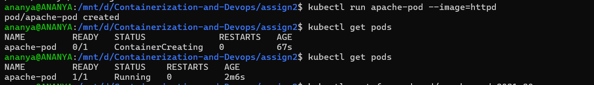
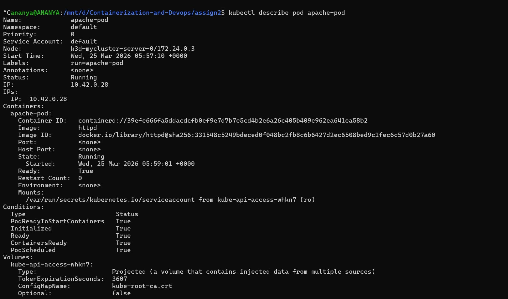
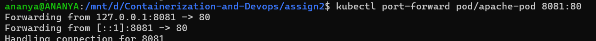
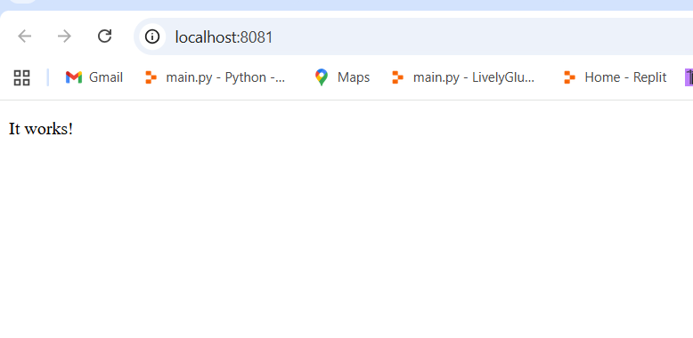
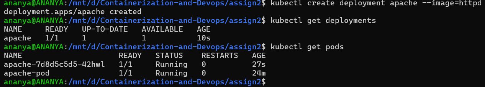
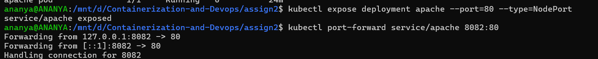
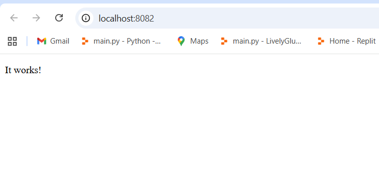

# Task: Deploy a Simple Web Application (Apache httpd)
Step 1: Run a Pod
```bash
kubectl run apache-pod -- image=httpd
```
Check:
```bash
kubectl get pods
```


---
Step 2: Inspect Pod
```bash
kubectl describe pod apache-pod
```
Focus:
· container image = httpd
· ports (default 80)
· events


---
Step 3: Access the App
```bash
kubectl port-forward pod/apache-pod 8081:80
```

Open:
```bash
http://localhost:8081

```


---
Step 5: Create Deployment
```bash
kubectl create deployment apache --image=httpd
```
Check:
```bash
kubectl get deployments
kubectl get pods
```


---
Step 6: Expose Deployment
```bash
kubectl expose deployment apache --port=80 --type=NodePort
```
Access again:
```bash
kubectl port-forward service/apache 8082:80
```

Open:
```bash
http://localhost:8082
```
