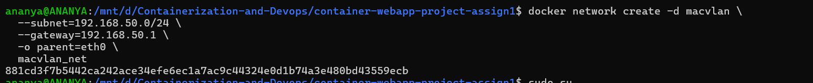
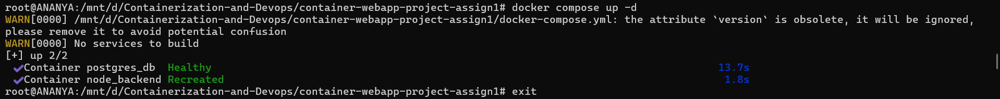
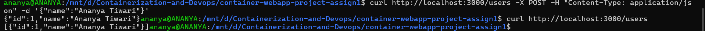
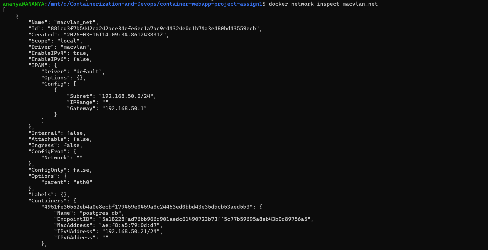
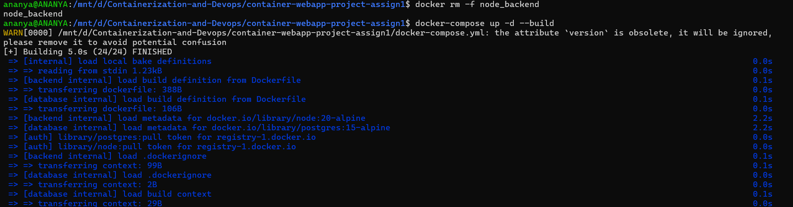
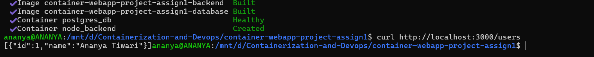

### Project Assignment 1 Containerized Web Application with PostgreSQL using Docker Compose and
Macvlan/Ipvlan

Objective

Design, containerize, and deploy a web application using:

- PostgreSQL (mandatory database)
- Backend API using either Node.js + Express OR FastAPI
- Docker multi-stage builds
- Separate Dockerfiles (Backend + Database)
- Docker Compose for orchestration
- Macvlan or Ipvlan networking (mandatory)

---
Step 1. Initialize a node package
```bash
npm init -y
```


Step 2. Install necessary packages
```bash
npm i express pg
```


Step 3. Create [package.json](./package.json)

Step 4. Create [server.js](./backend/src/server.js)

Step 5. Create [Dockerfile](./backend/Dockerfile) for backend

Step 6. Create .dockerignore file and include the following :
```bash
node_modules
npm-debug.log
Dockerfile
.git
.gitignore
```
Step 7. Create [Dockerfile](./database/Dockerfile) for database
```bash
FROM postgres:15-alpine

COPY init.sql /docker-entrypoint-initdb.d/
```
Step 8. Create [init.sql](./database/init.sql)
```bash
CREATE TABLE IF NOT EXISTS users(
    id SERIAL PRIMARY KEY,
    name TEXT
);
```
Step 9. Create [docker-compose.yml](./docker-compose.yml)
```bash
version: "3.9"

services:

  database:
    build: ./database
    container_name: postgres_db
    restart: always

    environment:
      POSTGRES_DB: mydb
      POSTGRES_USER: admin
      POSTGRES_PASSWORD: ananya

    volumes:
      - pgdata:/var/lib/postgresql/data

    networks:
      macvlan_net:
        ipv4_address: 192.168.50.21

    healthcheck:
      test: ["CMD-SHELL", "pg_isready -U admin"]
      interval: 10s
      retries: 5

  backend:
    build: ./backend
    container_name: node_backend
    restart: always

    environment:
      DB_HOST: 192.168.50.21
      POSTGRES_DB: mydb
      POSTGRES_USER: admin
      POSTGRES_PASSWORD: ananya

    depends_on:
      database:
        condition: service_healthy

    networks:
      macvlan_net:
        ipv4_address: 192.168.50.20
      bridge_net: {}      

    ports:
      - "3000:3000"   

volumes:
  pgdata:

networks:
  macvlan_net:
    external: true
  bridge_net:            
    driver: bridge
```
Step 10. Find the network interface
```bash
ip a
```
Step 11. Create network
```bash
docker network create -d macvlan \
  --subnet=192.168.50.0/24 \
  --gateway=192.168.50.1 \
  -o parent=eth0 \
  macvlan_net
```


Step 12. Build from compose
```bash
docker-compose build --no-cache
```


Step 13. Start services
```bash
docker-compose up -d
```


Step 13. Insert a user in database
```bash
 curl -X POST http://192.168.50.20:3000/users \
-H "Content-Type: application/json" \
-d '{"name":"Ananya Tiwari"}'
 ```
 Step 14. GET user API
 ```bash
  curl http://192.168.50.20:3000/users
  ```
 

Step 15. List running containers
```bash
docker ps
```


Step 16. List Volumes
```bash
docker volume ls
```


Step 17. Inspect network
```bash
docker network inspect macvlan_net
```


Step 18. Inspect backend container
```bash
docker inspect node_backend
```


Step 19. Inspect database
```bash
docker inspect postgres_db
```


Step 20. Verify data persistance
```bash
docker-compose down
docker-compose up -d
curl http://localhost:3000/users
```


