# Project Assignment 1 Containerized Web Application with PostgreSQL using Docker Compose and Macvlan/Ipvlan

## Objectives

Design, containerize, and deploy a web application using:

- PostgreSQL (mandatory database)
- Backend API using either Node.js + Express OR FastAPI
- Docker multi-stage builds
- Separate Dockerfiles (Backend + Database)
- Docker Compose for orchestration
- Macvlan or Ipvlan networking (mandatory)
---
## Architecture
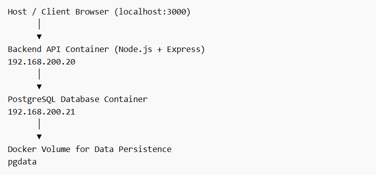
---

## Project Structure
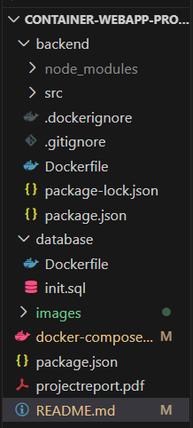

---

Step 1. Initialize a node package and [package.json](./backend/package.json) will be created.
```bash
npm init -y
```
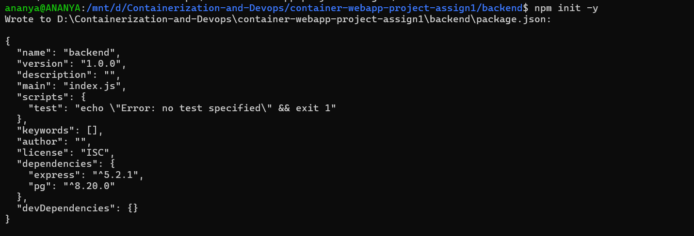

Step 2. Install necessary packages
```bash
npm i express pg
```
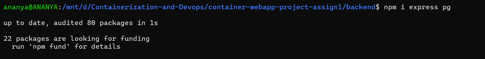

Step 3. Create [server.js](./backend/src/server.js)
```bash
const express = require("express");
const { Pool } = require("pg");


const app = express();
app.use(express.json());

const pool = new Pool({
  host: process.env.DB_HOST,
  user: process.env.POSTGRES_USER,
  password: process.env.POSTGRES_PASSWORD,
  database: process.env.POSTGRES_DB,
  port: 5432
});

async function initDB() {
  await pool.query(`
    CREATE TABLE IF NOT EXISTS users(
        id SERIAL PRIMARY KEY,
        name TEXT
    )
  `);
}

initDB();

app.get("/health", (req, res) => {
  res.send("Server healthy");
});

app.post("/users", async (req, res) => {
  const { name } = req.body;

  const result = await pool.query(
    "INSERT INTO users(name) VALUES($1) RETURNING *",
    [name]
  );

  res.json(result.rows[0]);
});

app.get("/users", async (req, res) => {
  const result = await pool.query("SELECT * FROM users");
  res.json(result.rows);
});

app.listen(3000, "0.0.0.0", () => {
  console.log("Server running on port 3000");
});
```

Step 4. Create [Dockerfile](./backend/Dockerfile) for backend
```bash
# Builder Stage
FROM node:20-alpine AS builder

WORKDIR /app

COPY package*.json ./

RUN npm install --only=production

COPY . .

# Runtime Stage
FROM node:20-alpine

WORKDIR /app

RUN addgroup -S appgroup && adduser -S appuser -G appgroup

COPY --from=builder /app .

USER appuser

EXPOSE 3000

CMD ["node", "src/server.js"]
```

Step 5. Create .dockerignore file and include the following :
```bash
node_modules
npm-debug.log
Dockerfile
.git
.gitignore
```
Step 6. Create [Dockerfile](./database/Dockerfile) for database
```bash
FROM postgres:15-alpine

COPY init.sql /docker-entrypoint-initdb.d/
```
Step 7. Create [init.sql](./database/init.sql)
```bash
CREATE TABLE IF NOT EXISTS users(
    id SERIAL PRIMARY KEY,
    name TEXT
);
```
Step 8. Create [docker-compose.yml](./docker-compose.yml)
```bash
services:

  database:
    build: ./database
    container_name: postgres_db
    restart: always

    environment:
      POSTGRES_DB: mydb
      POSTGRES_USER: admin
      POSTGRES_PASSWORD: ananya

    volumes:
      - pgdata:/var/lib/postgresql/data

    networks:
      ipvlan_net:
        ipv4_address: 192.168.200.21

    healthcheck:
      test: ["CMD-SHELL", "pg_isready -U admin -d mydb"]
      interval: 10s
      timeout: 5s
      retries: 5


  backend:
    build: ./backend
    container_name: node_backend
    restart: always

    environment:
      DB_HOST: 192.168.200.21
      POSTGRES_DB: mydb
      POSTGRES_USER: admin
      POSTGRES_PASSWORD: ananya

    depends_on:
      database:
        condition: service_healthy

    networks:
      ipvlan_net:
        ipv4_address: 192.168.200.20
      default:   

    ports:
      - "3000:3000"


volumes:
  pgdata:


networks:
  ipvlan_net:
    driver: ipvlan
    driver_opts:
      parent: eth0
    ipam:
      config:
        - subnet: 192.168.200.0/24
          gateway: 192.168.200.1
```

Step 9. Build from compose
```bash
docker-compose build --no-cache
```
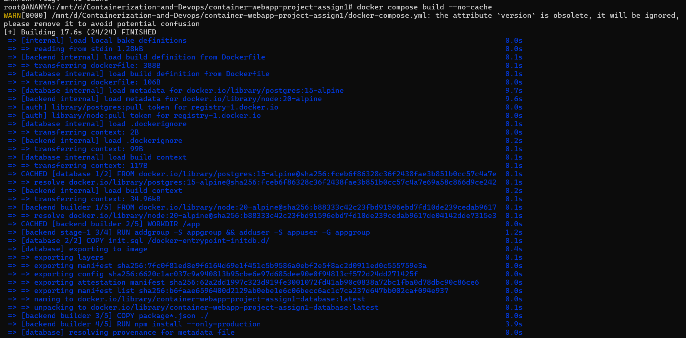

Step 10. Start services
```bash
docker-compose up -d
```
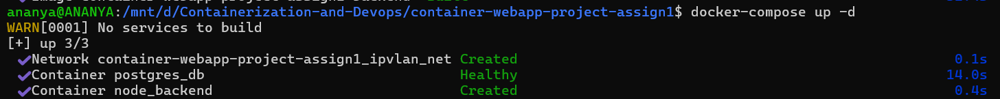

Step 11. List running containers
```bash
docker ps
```
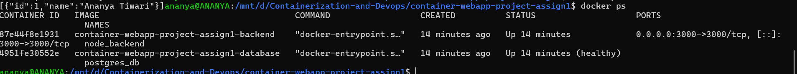

Step 12. List Volumes
```bash
docker volume ls
```
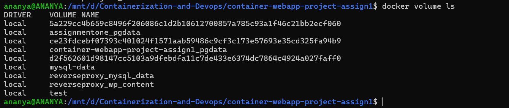

Step 13. Inspect network
```bash
 docker network inspect container-webapp-project-assign1_ipvlan_net
```
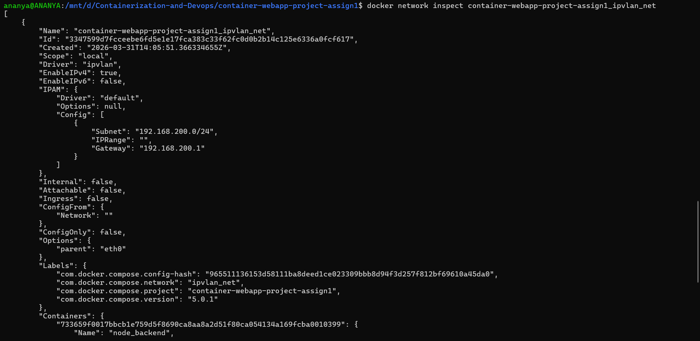

Step 14. Inspect backend container
```bash
docker inspect node_backend
```
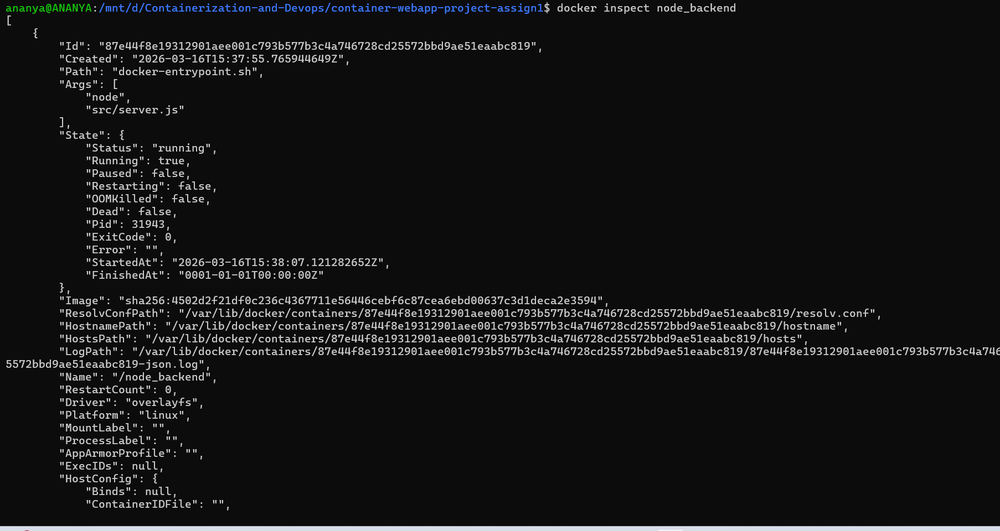

Step 15. Inspect database
```bash
docker inspect postgres_db
```
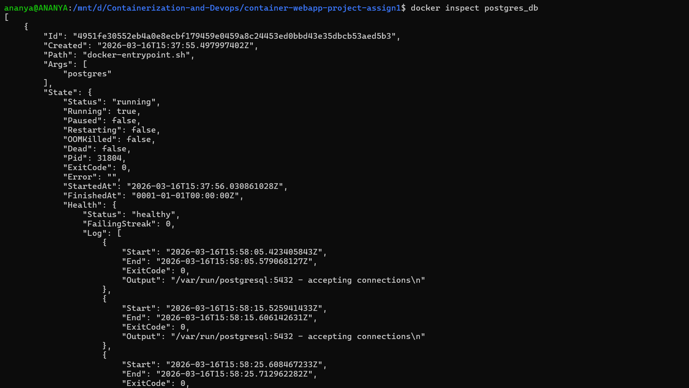

Step 16. Verify data persistance
```bash
docker-compose down
docker-compose up -d
curl http://localhost:3000/users
```
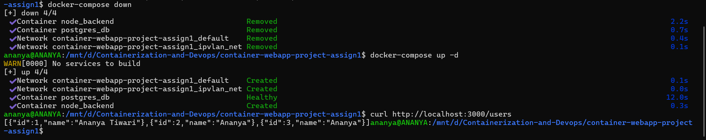
---

### API CHECKPOINTS
1. Health check
```bash
curl http://localhost:3000/health
```
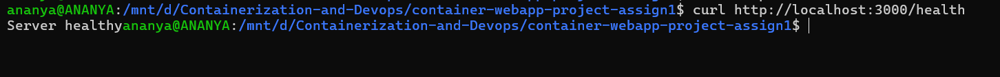

- Runs a temporary container to check the health of the Node backend API via the /health endpoint.
```bash
docker run --rm --network container-webapp-project-assign1_ipvlan_net curlimages/curl \
  http://192.168.200.20:3000/health
  ```
  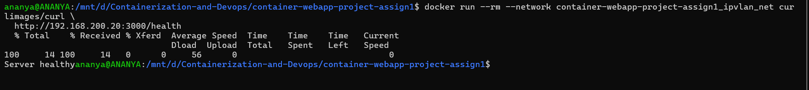

2. Insert user
```bash
curl -X POST http://localhost:3000/users \
     -H "Content-Type: application/json" \
     -d '{"name":"Ananya"}'
```
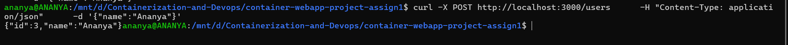
- Runs a temporary container to test the Node backend API by sending a POST request.
```bash
docker run --rm --network container-webapp-project-assign1_ipvlan_net curlimages/curl \
  -X POST http://192.168.200.20:3000/users \
  -H "Content-Type: application/json" \
  -d '{"name":"Ananya"}'
  ```
  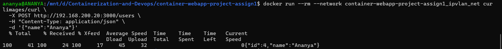

3. Fetch users
```bash
curl http://localhost:3000/users
```
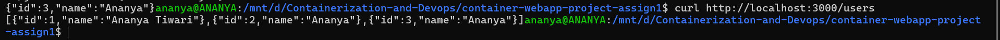

- Runs a temporary container to fetch and display all users from the Node backend API.
```bash
docker run --rm --network container-webapp-project-assign1_ipvlan_net curlimages/curl \
  -X GET http://192.168.200.20:3000/users
  ```
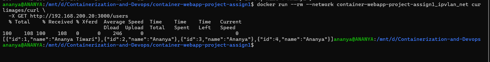
---
---
## MACvlan vs IPvlan 
### Macvlan vs Ipvlan Comparison

| Feature       | Macvlan                             | Ipvlan                             |
|---------------|------------------------------------|-----------------------------------|
| Isolation     | High, unique MAC per container     | Shares MAC with parent network    |
| IP Assignment | One IP per container               | Multiple IPs can share a MAC      |
| Use Case      | Host communication, static IP      | Host communication, static IP     |
| Complexity    | Higher; must plan subnet carefully | Lower; simpler setup              |
| Performance   | Near-native                        | Near-native, slightly simpler     |

---
---
## Reason for Using localhost Instead of Macvlan / IPvlan
- In WSL2, the host runs in a virtualized network.
- IPvlan and Macvlan give containers IPs on your physical LAN subnet, making containers behave like independent devices.
- WSL host cannot talk to IPvlan/Macvlan IPs directly because of Linux kernel network restrictions.
- So, direct host to container via IPvlan/Macvlan fails.

1. IPvlan setup
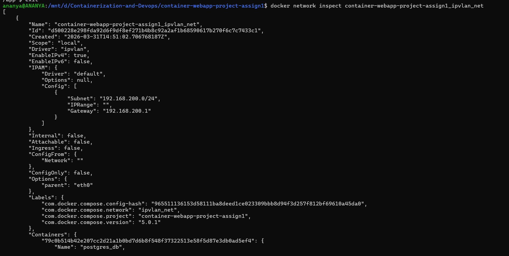

2. Container to container communication is working over ipvlan
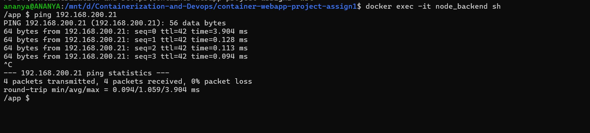

3. WSL Limitation

