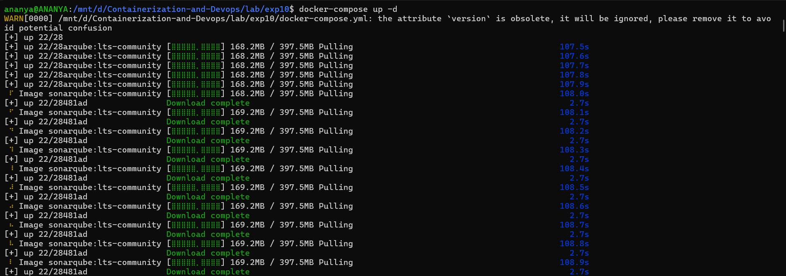
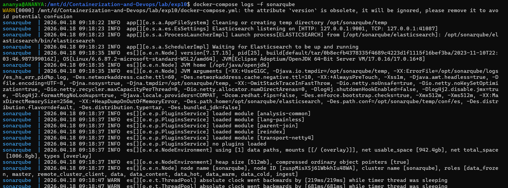
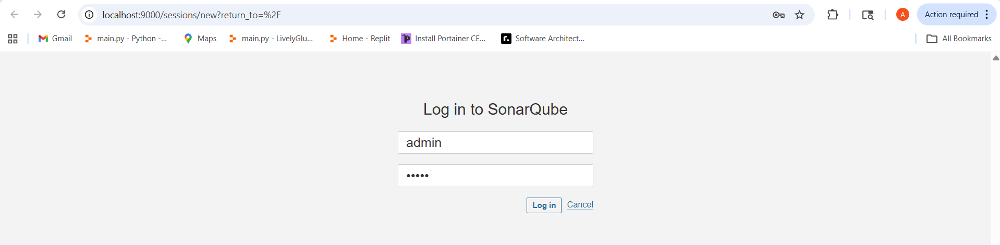
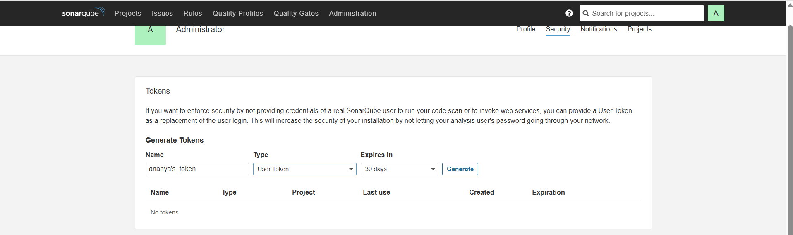
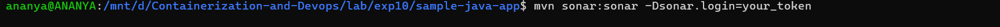
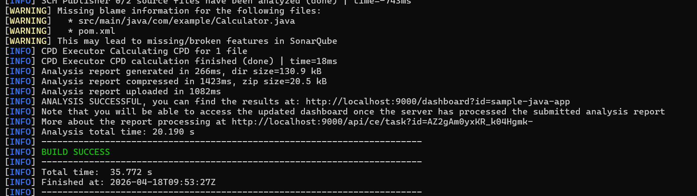
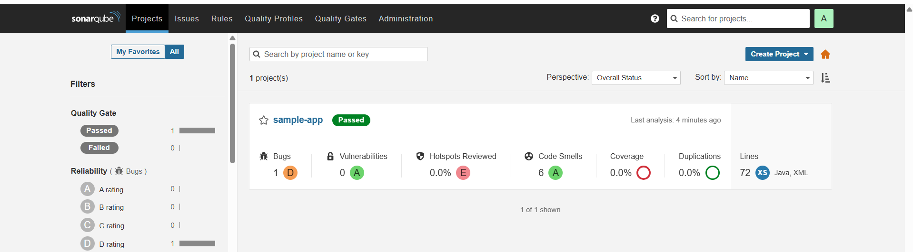

# Experiment 10: SonarQube - Static Code Analysis

**Step 1: Start the SonarQube Server**

We will use Docker Compose to start both the SonarQube server and its PostgreSQL database together.

Create a file called [docker-compose.yml](./docker-compose.yml)

```bash
version: '3.8'
services:
  sonar-db:
    image: postgres:13
    container_name: sonar-db
    environment:
      POSTGRES_USER: sonar
      POSTGRES_PASSWORD: sonar
      POSTGRES_DB: sonarqube
      POSTGRES_HOST_AUTH_METHOD: trust
    volumes:
      - sonar-db-data:/var/lib/postgresql/data
    networks:
      - sonarqube-lab

  sonarqube:
    image: sonarqube:lts-community
    container_name: sonarqube
    ports:
      - "9000:9000"
    environment:
      SONAR_JDBC_URL: jdbc:postgresql://sonar-db:5432/sonarqube
      SONAR_JDBC_USERNAME: sonar
      SONAR_JDBC_PASSWORD: sonar
    depends_on:
      - sonar-db
    networks:
      - sonarqube-lab

volumes:
  sonar-db-data:

networks:
  sonarqube-lab:
  ```

Start both containers:
```bash
docker-compose up -d
# Watch the logs until you see "SonarQube is up"
docker-compose logs -f sonarqube
```



Once started, open http://localhost:9000 in your browser.


---

**Step 2 : Generate Token**

Inside dashboard :

Click profile (top-right)


→ My Account


→ Security


Generate token

Save it somewhere



---

**Step 3: Create Sample Java Project**
```bash
mkdir -p sample-java-app/src/main/java/com/example
cd sample-java-app
```
- Create file [Calculator.java](./sample-java-app/src/main/java/com/example/Calculator.java)

- Create file [pom.xml](./sample-java-app/pom.xml)

---

**Step 4: Run Scanner**

Inside project folder :
```bash
mvn sonar:sonar -Dsonar.login=YOUR_TOKEN
```



---

**Step 5: View Results**

Open :
```bash
http://localhost:9000
```


---

**Step 6 : Stop the Server**
```bash
docker-compose down
```
