# Experiment 11 Title: Orchestration using Docker Compose & Docker Swarm (Continuation of Experiment 6)

**The Progression Path**


**Prerequisties**
- Docker installed (with Swarm mode enabled)
- The docker-compose.yml file from Experiment 6 (WordPress + MySQL)

### Task 1: Check Current State (No Swarm)
```bash
docker compose down -v
docker ps
```
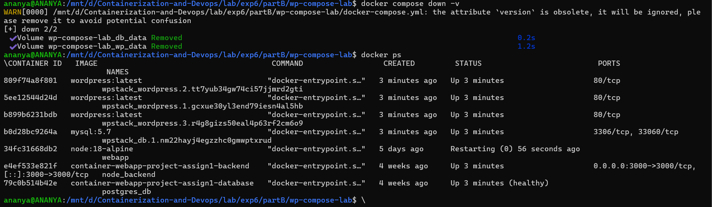

### Task 2: Initialize Docker Swarm

Swarm mode turns your current machine into a manager node of a cluster.
```bash
docker swarm init
```
What this command does:

- Enables Swarm mode on your Docker daemon
- Makes this node a "manager" (can control the cluster)
- Creates a join token for worker nodes (not needed for single-node)

- Verify swarm is active
```bash
docker node ls
```
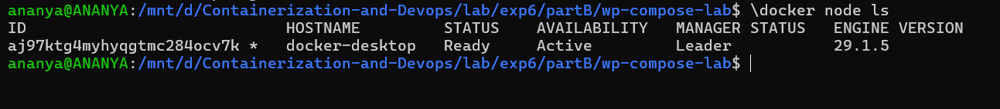

### Task 3: Deploy as a Stack (Not Just Compose)

In Swarm, we deploy a stack (a group of services) using the same [Compose file](./docker-compose.yml).
```bash
docker stack deploy -c docker-compose.yml wpstack
```


### Task 4: Verify the Deployment

- List all services in the stack:
```bash
docker service ls
```
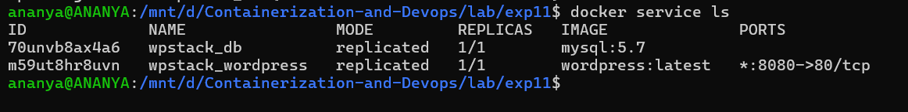

- See detailed tasks (containers) for a service :
```bash
docker service ps wpstack_wordpress
```
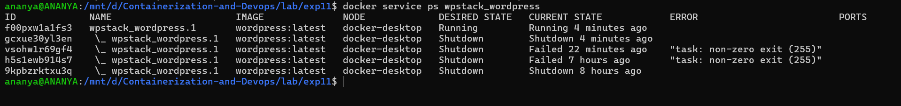

- See all running containers
```bash
docker ps
```
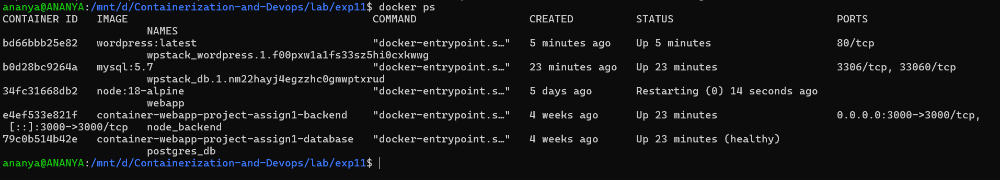

### Task 5: Access WordPress

Open your browser:
```bash
http://localhost:8080
```


### Task 6: Scale the Application (Swarm's Superpower)

This is where Swarm shines over plain Compose.

- Scale WordPress from 1 to 3 replicas:
```bash
docker service scale wpstack_wordpress=3
```
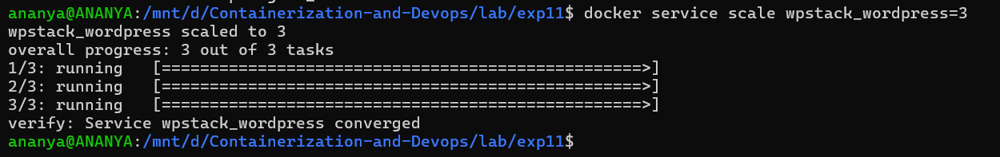

- Verify scaling:
```bash
docker service ls
```
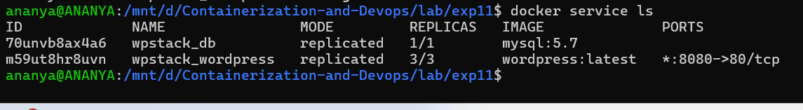

- Check containers
```bash
docker ps | grep wordpress
```
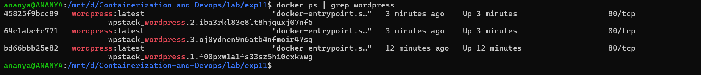

### Task 7: Test Self-Healing (Automatic Recovery)

Self-healing = Swarm automatically replaces failed containers.

Step 1: Find a WordPress container
```bash
docker ps | grep wordpress
```
- Copy the CONTAINER ID of one WordPress container.

Step 2: Kill it (simulate a crash)
```bash
docker kill <container-id>
```
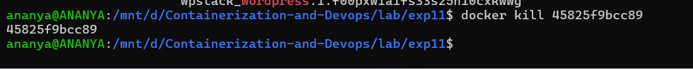

Step 3: Watch Swarm recreate it
```bash
docker service ps wpstack_wordpress
```
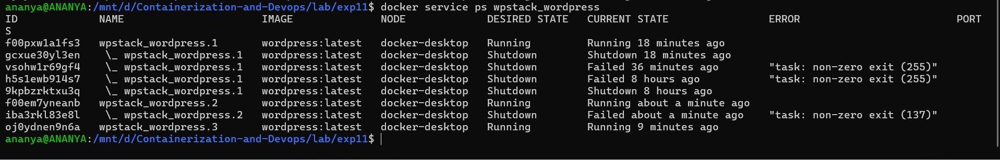

Step 4: Verify new container is running
```bash
docker ps | grep wordpress
```


Task 8: Remove the Stack

- Clean up everything:
```bash
docker stack rm wpstack
```
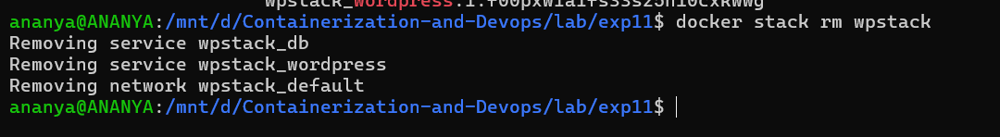

- Verify :
```bash
docker service ls
docker ps
```
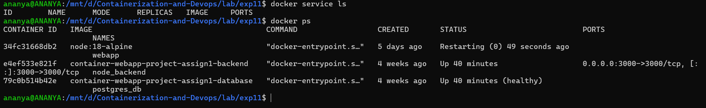

### ANALYSIS (Compose vs Swarm)

Side-by-Side Comparison :
| Feature            | Docker Compose                          | Docker Swarm                          |
|--------------------|------------------------------------------|----------------------------------------|
| Scope              | Single host only                        | Multi-node cluster                    |
| Scaling            | --scale flag (basic)                    | docker service scale (built-in)       |
| Load Balancing     | No (port conflicts, no LB)              | Yes (internal load balancing)         |
| Self-Healing       | No (manual restart required)            | Yes (automatic recovery)              |
| Rolling Updates    | No                                     | Yes (zero downtime)                   |
| Service Discovery  | Via container names                     | Via DNS + VIP                         |
| Use Case           | Development, testing                    | Simple production clusters            |
| Complexity         | Low                                    | Medium                                |