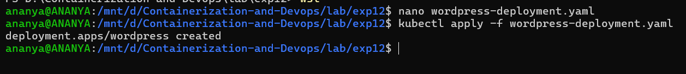
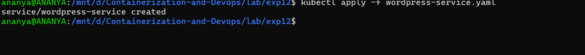
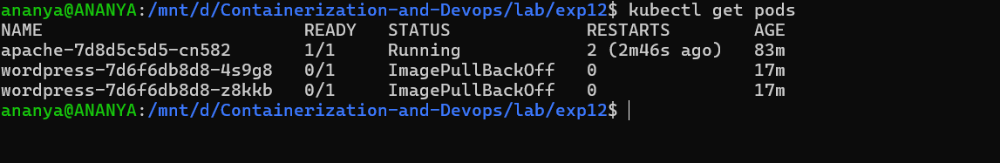
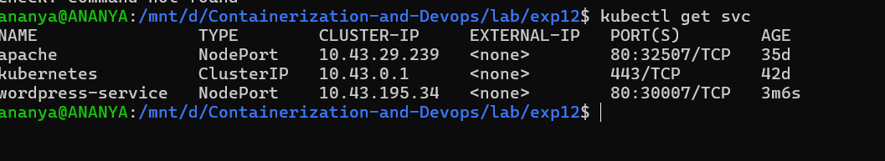
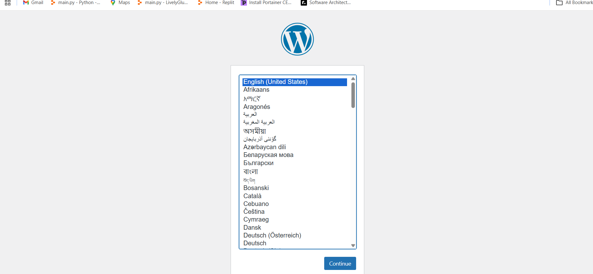
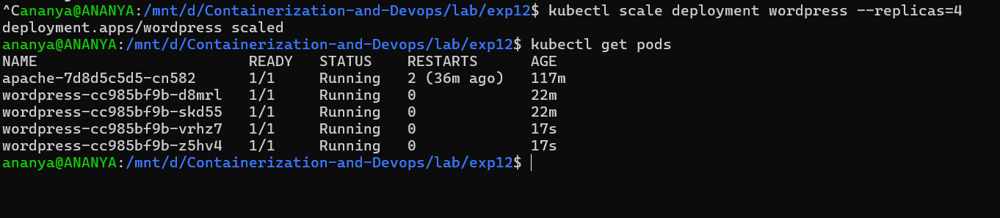
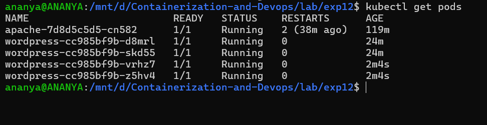
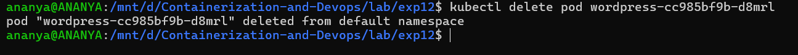
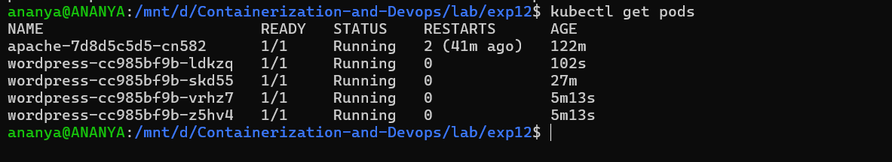

# Experiment 12: Study and Analyse Container Orchestration using Kubernetes

## Objective :

- Learn why Kubernetes is used, its basic concepts, and how to deploy, scale, and fix apps using Kubernetes commands.

**Why Kubernetes over Docker Swarm**
## Why Kubernetes over Docker Swarm?

| Reason               | Explanation                                      |
|---------------------|--------------------------------------------------|
| Industry standard   | Most companies use Kubernetes                    |
| Powerful scheduling | Automatically decides where to run your app      |
| Large ecosystem     | Many tools and plugins available                 |
| Cloud-native support| Works on AWS, Google Cloud, Azure, etc.          |

**Core Kubernetes Concepts**
## Why Kubernetes over Docker Swarm?

| Reason               | Explanation                                      |
|---------------------|--------------------------------------------------|
| Industry standard   | Most companies use Kubernetes                    |
| Powerful scheduling | Automatically decides where to run your app      |
| Large ecosystem     | Many tools and plugins available                 |
| Cloud-native support| Works on AWS, Google Cloud, Azure, etc.          |

### Task 1: Create a Deployment

It tells Kubernetes:
- Which app to run (WordPress)
- How many copies (replicas)
- How to manage them

Step 1. Create [YAML file](./wordpress-deployment.yaml)
```bash
nano wordpress-deployment.yaml
```
And add this :
```bash
apiVersion: apps/v1
kind: Deployment
metadata:
  name: wordpress
spec:
  replicas: 2
  selector:
    matchLabels:
      app: wordpress
  template:
    metadata:
      labels:
        app: wordpress
    spec:
      containers:
      - name: wordpress
        image: wordpress:latest
        ports:
        - containerPort: 80
```

Step 2: Apply Deployment
```bash
kubectl apply -f wordpress-deployment.yaml
```



- Kubernetes creates 2 pods
- Each pod runs a WordPress container

### Task 2: Expose Deployment (Service)
Pods are temporary so we create a Service to access them.

Step 1: Create [Service file](./wordpress-service.yaml)
```bash
nano wordpress-service.yaml
```
Add :
```bash
apiVersion: v1
kind: Service
metadata:
  name: wordpress-service
spec:
  type: NodePort
  selector:
    app: wordpress
  ports:
  - port: 80
    targetPort: 80
    nodePort: 30007
```
Step 2: Apply Service
```bash
kubectl apply -f wordpress-service.yaml
```


### Task 3: Verify Everything

- Check pods 
```bash
kubectl get pods
```


- Check Service
```bash
kubectl get svc
```


- Access WordPress
```bash
http://localhost:8888
```


### Task 4: Scale Deployment
Increase pods from 2 → 4:
```bash
kubectl scale deployment wordpress --replicas=4
```
- Check 
```bash
kubectl get pods
```


### Task 5: Self-Healing

Step 1: See pods
```bash
kubectl get pods
```


Step 2: Delete one pod
```bash
kubectl delete pod <pod-name>
```


Step 3: Check again
```bash
kubectl get pods
```


---

**Swarm vs Kubernetes**
| Feature       | Docker Swarm        | Kubernetes                          |
|---------------|---------------------|-------------------------------------|
| Setup         | Very easy           | More complex                        |
| Scaling       | Basic               | Advanced (auto-scaling)             |
| Ecosystem     | Small               | Huge (monitoring, logging, tools)   |
| Industry use  | Rare                | Standard                            |