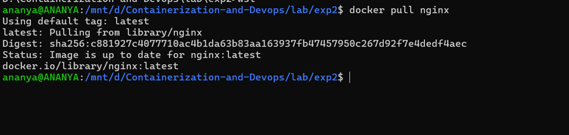
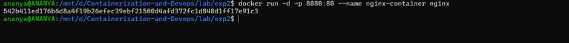
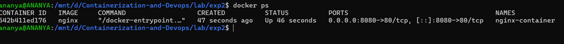
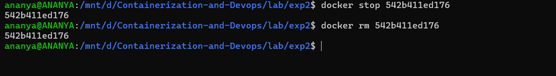
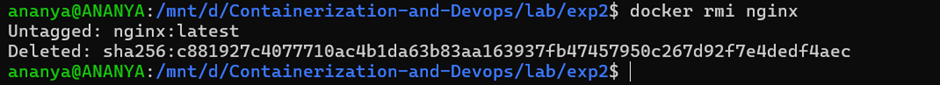

# EXPERIMENT 2: Docker Installation, Configuration and Running Images

---

## Objective
- Pull Docker images  
- Run Docker containers  
- Manage container lifecycle  

---

## Procedure

---

### Step 1: Pull Docker Image

Pull the official nginx image from Docker Hub.

```bash
docker pull nginx
```



---

### Step 2: Run Container with Port Mapping
To start an Nginx container in detached mode and map port 8080 on your host to port 80 in the container, run:

```bash
docker run -d -p 8080:80 nginx
```



---

### Step 3: Verify running containers
To check the list of currently running containers, use the following command:
```bash
docker ps
```


---

### Step 4: Stop and Remove Container
First, stop the running container using its container ID:
```bash
docker stop <container_id>
```
Then, remove the stopped container:
```bash
docker rm <container_id>
```


---

### Step 5: Remove Image
To remove the Docker image from the system, run:
```bash
docker rmi nginx
```


---

## Conclusion

---
This lab demonstrated virtualization using Vagrant + VirtualBox and containerization using Docker, highlighting clear differences in performance and resource efficiency. Containers are better suited for rapid deployment and microservices, while virtual machines provide stronger isolation.


