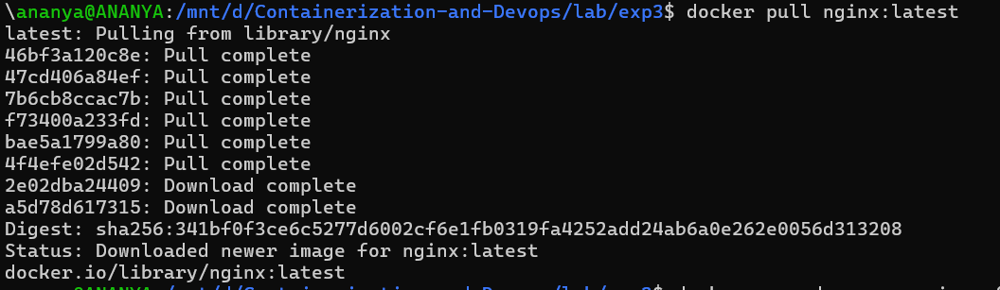
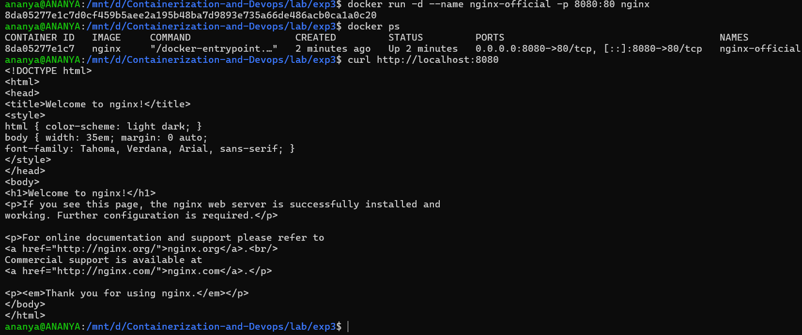
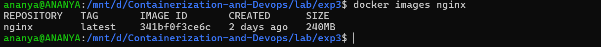
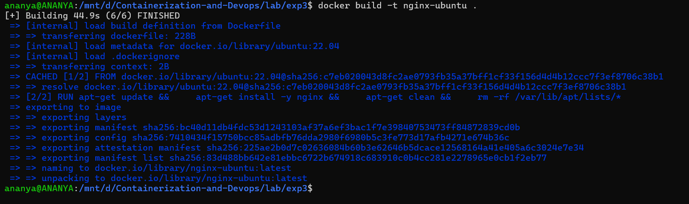
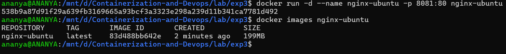
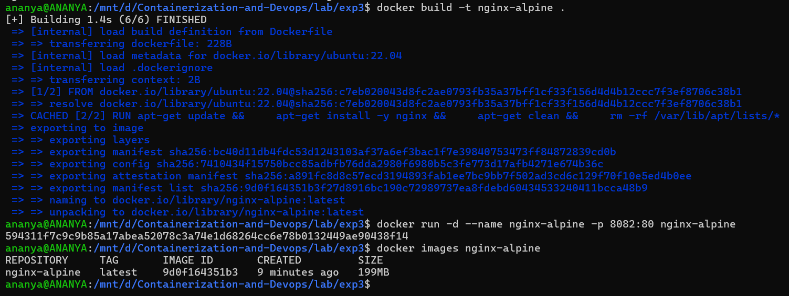
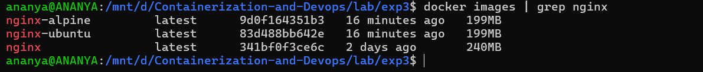
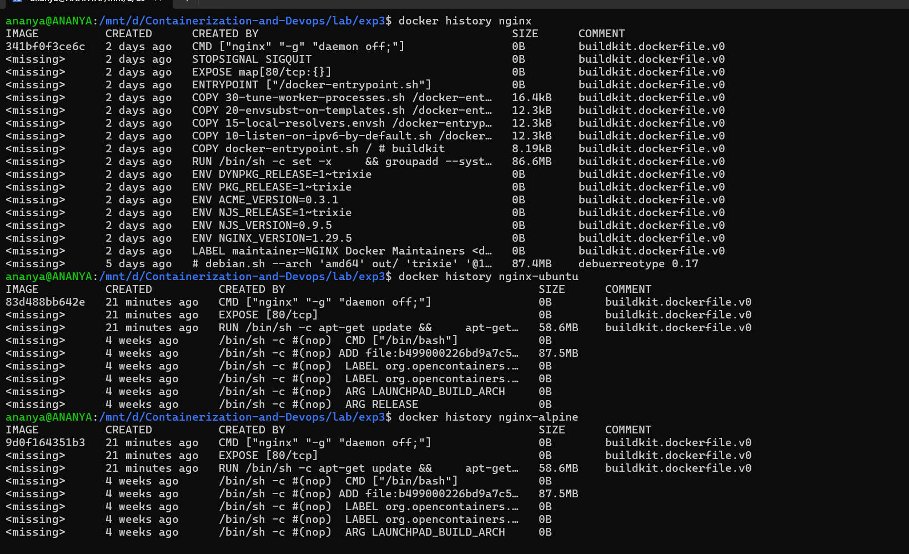
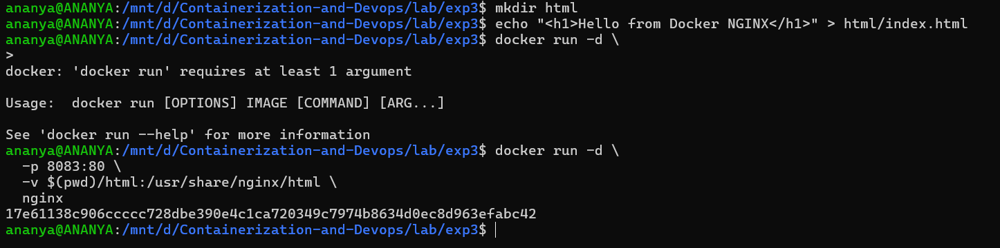

## EXPERIMENT:3 Deploying NGINX Using Different Base Images and Comparing Image Layers
### Part 1: Deploy NGINX Using Official Image (Recommended Approach)
Step 1: Pull the Image
```bash
docker pull nginx:latest
```


---
Step 2: Run the Container
```bash
docker run -d -- name nginx-official -p 8080:80 nginx
```
---
Step 3: Verify
```bash
curl http://localhost:8080
```


---
Key Observations :
```bash
docker images nginx
```

- Image is pre-optimized
- Minimal configuration required
- Uses Debian-based OS internally
---
---

### Part 2: Custom NGINX Using Ubuntu Base Image

Step 1: Create Dockerfile

[docker file](./Dockerfile)

---

Step 2: Build Image
```bash
docker build -t nginx-ubuntu .
```


---

Step 3: Run Container
```bash
docker run -d --name nginx-ubuntu -p 8081:80 nginx-ubuntu
```
---
Observations :
```bash
docker images nginx-ubuntu
```


- Much larger image size
- More layers
- Full OS utilities available
---
---
### Part 3: Custom NGINX Using Alpine Base Image

Step 1: Create Dockerfile

[Docker file](./Dockerfiletwo)

---

Step 2: Build Image
```bash
docker build -t nginx-alpine .
```
---

Step 3: Run Container
```bash
docker run -d -- name nginx-alpine -p 8082:80 nginx-alpine
```
---
Observations
```bash
docker images nginx-alpine
```

- Extremely small image
- Fewer packages
- Faster pull and startup time

---
---
### Part 4: Image Size and Layer Comparison

1. Compare Sizes
```bash
docker images | grep nginx
```
Result :


---

2. Inspect Layers
```bash
docker history nginx
docker history nginx-ubuntu
docker history nginx-alpine
```

Observations:

- Ubuntu has many filesystem layers
- Alpine has minimal layers
- Official NGINX image is optimized but heavier than Alpine

---
---

### Part 5: Functional Tasks Using NGINX

Task 1: Serve Custom HTML Page
```bash
mkdir html
echo "<h1>Hello from Docker NGINX</h1>" > html/index.html
```
Run:
```bash
docker run -d \
-p 8083:80 \
-v $(pwd)/html:/usr/share/nginx/html \
nginx
```

