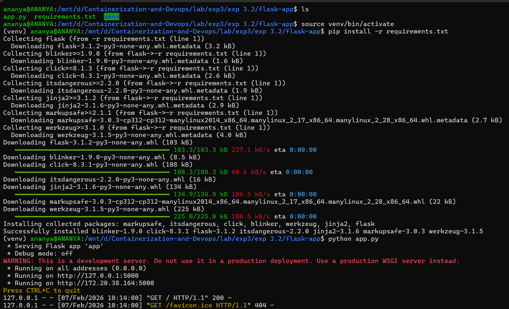
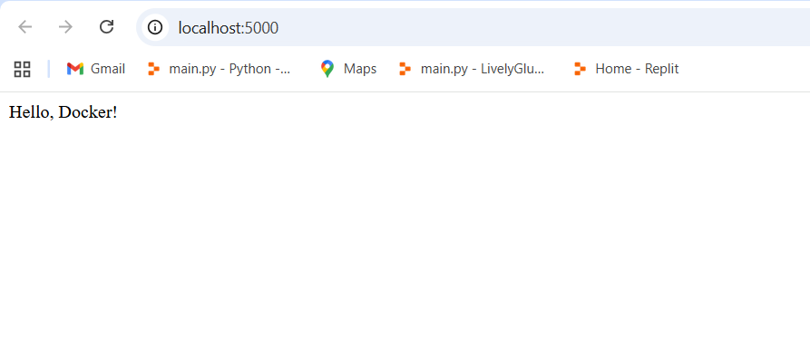
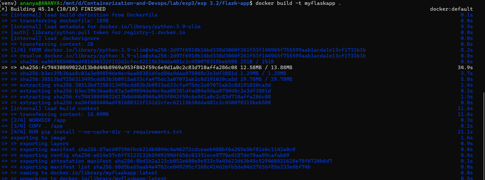
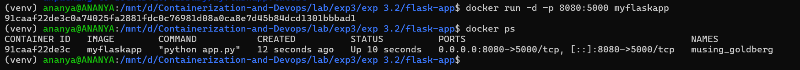
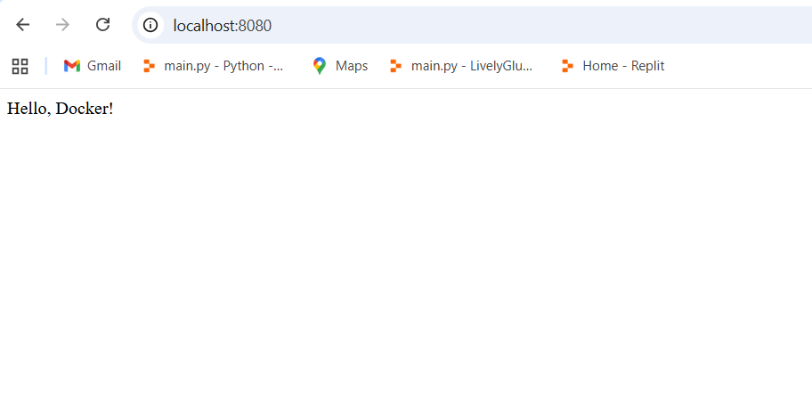
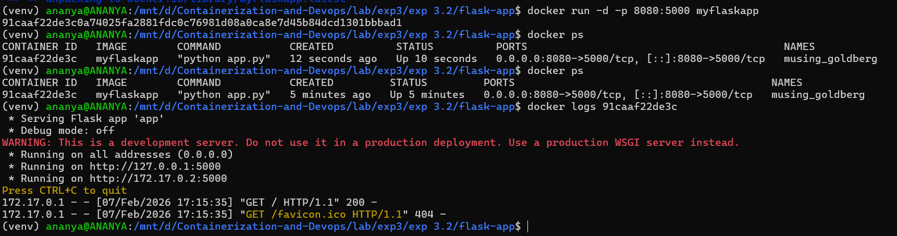

### Deploying Web Applications with Docker

Step 1. Create a project folder
```bash
mkdir flask-app
cd flask-app
```
---

Step 2: Create the Application Files
- Create [app.py](./flask-app/app.py)
- Create [requirements.txt](./flask-app/requirements.txt)

---
Step 3: Test the Application Locally
- Create & activate a virtual environment
```bash
python3 -m venv venv
```
- Activate the virtual environment
```bash
source venv/bin/activate
```
- Install Dependencies
```bash
pip install -r requirements.txt
```
- Run the app locally
```bash
python app.py
```

- Test in browser
```bash
http://localhost:5000

```


---
---
### Building and Running the Web Application Container

Step 1. Create the [Dockerfile](./flask-app/Dockerfile)

---

Step 2. Build the Docker image.
```bash
docker build -t myflaskapp .
```


---

Step 3. Run the Web Application Container
```bash
docker run -d -p 8080:5000 myflaskapp
```
- Verify
```bash
docker ps
```


---

Step 4. Verify the Application
- Open browser and navigate to http://localhost:8080


---

Step 5. View Container Logs

- Get the container id
```bash
docker ps
```
- View logs
```bash
docker logs <container-id>
```
