# Experiment 4: Docker Essentials

## Part 1: Containerizing Applications with Dockerfile
Step 1: Create Project Folder.
- Inside terminal :
```bash
mkdir my-flask-app
cd my-flask-app
```
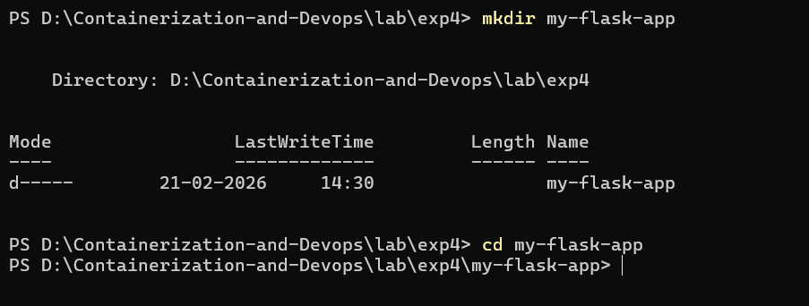
---
Step 2: Create Application Files.
- Inside my-flask-app, create [app.py](./my-flask-app/app.py)
```bash
from flask import Flask
app = Flask(__name__)

@app.route('/')
def hello():
    return "Hello from Docker!"

@app.route('/health')
def health():
    return "OK"

if __name__ == '__main__':
    app.run(host='0.0.0.0', port=5000)
```
- Create [requirements.txt](./my-flask-app/requirements.txt)
```bash
Flask==2.3.3
```
---
Step 3: Create [Dockerfile](./my-flask-app/Dockerfile).
```bash
# Use official Python image
FROM python:3.10-slim

# Set working directory
WORKDIR /app

# Copy requirements first
COPY requirements.txt .

# Install dependencies
RUN pip install --no-cache-dir -r requirements.txt

# Copy application code
COPY . .

# Expose port
EXPOSE 5000

# Run the application
CMD ["python", "app.py"]
```
---

## Part 2: Using .dockerignore

Step 1: Create .dockerignore file.
```bash
__pycache__/
*.pyc
*.pyo
*.pyd
.env
.venv
env/
venv/
.vscode/
.idea/
.git/
.gitignore
.DS_Store
Thumbs.db
*.log
logs/
tests/
test_*.py

```
---

## Part 3: Building Docker Images
Step 1: Build Docker Image.
```bash
docker build -t my-flask-app .
```
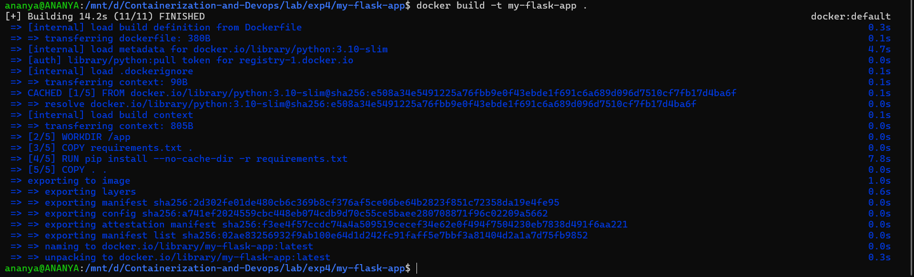

- Check build images.
```bash
docker images
```
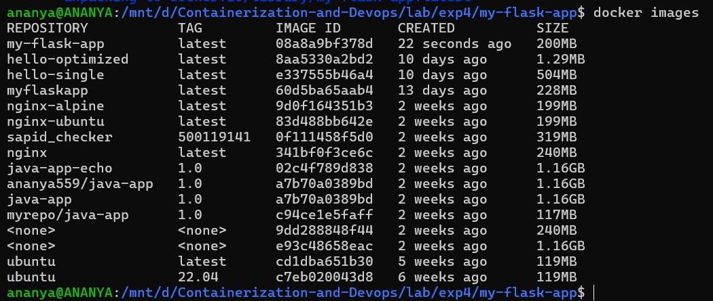

---
Step 2: Tagging Images

- Tag with version number
```bash
docker build -t my-flask-app:1.0 .
```
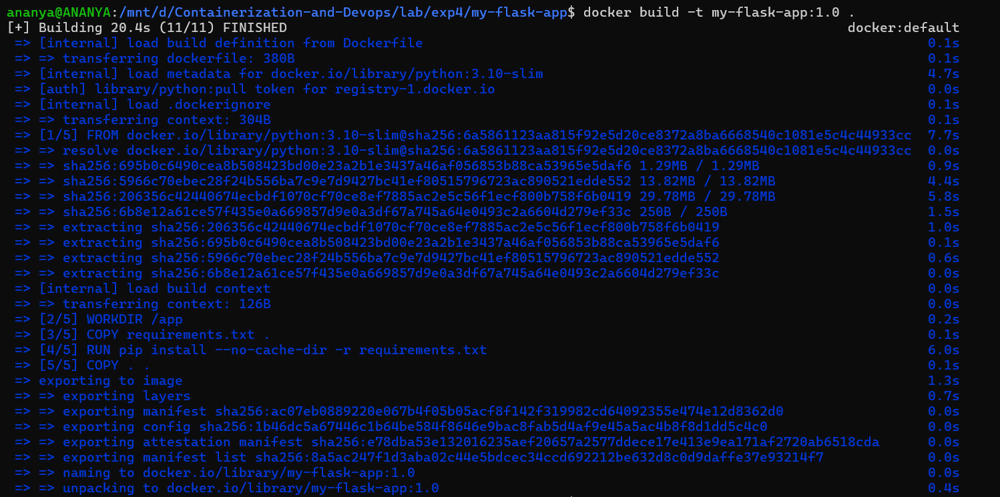
-  Tag with multiple tags
```bash
docker build -t my-flask-app:latest -t my-flask-app:1.0 .
```
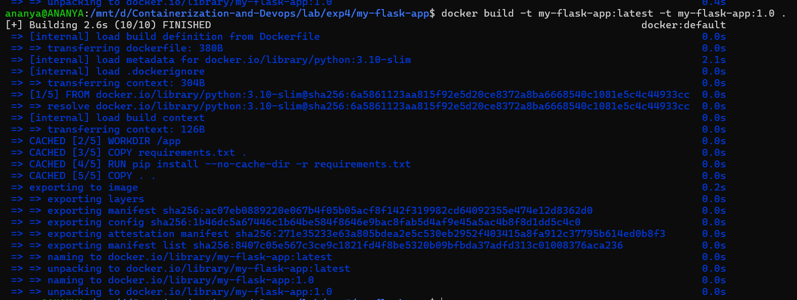
- Tag with custom registry
```bash
docker build -t username/my-flask-app:1.0 .
```
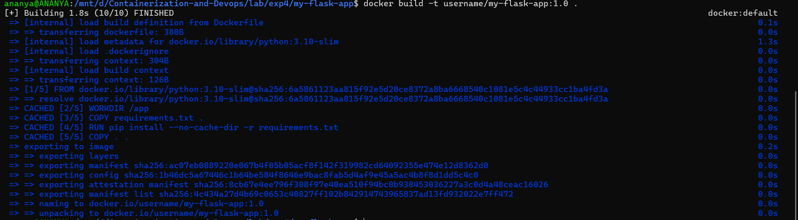

- Tag existing image
```bash
docker tag my-flask-app:latest my-flask-app:v1 . 
```
---
Step 3: View Image Details

- List all images
```bash
docker images
```

- Show image history
```bash
docker history my-flask-app
```
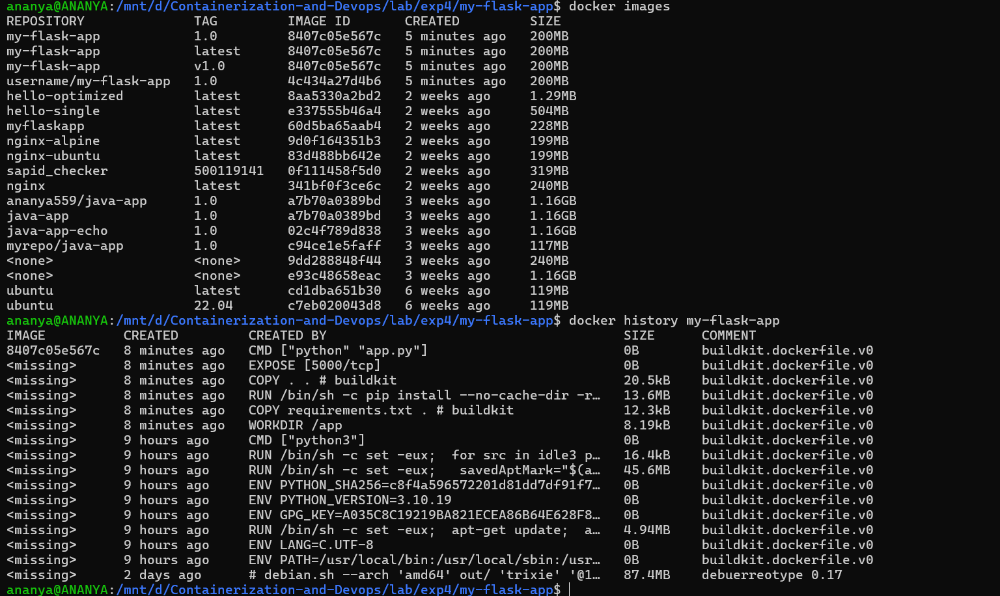
- Inspect image details
```bash
docker inspect my-flask-app
```
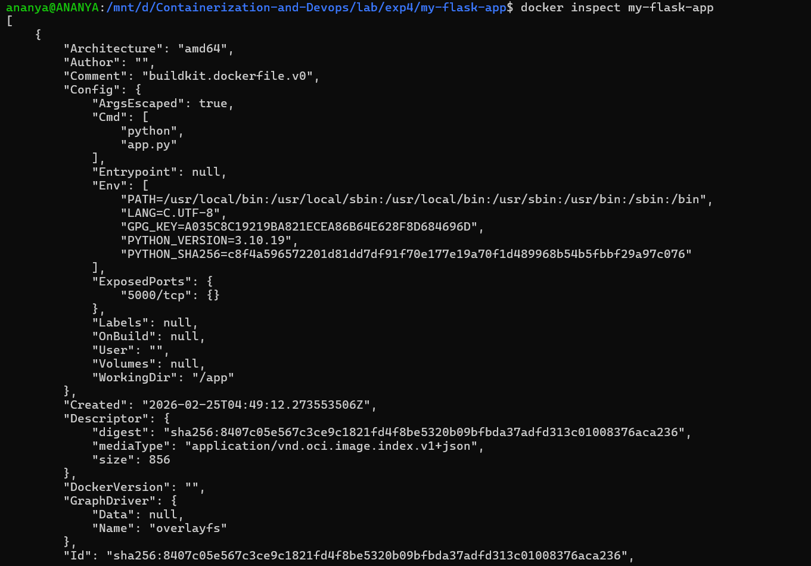

---
## Part 4: Running Containers

Step 1: Run Container

- Run container with port mapping
```bash
docker run -d -p 5000:5000 --name flask-container my-flask-app
```
- Test the application
```bash
curl http://localhost:5000
```

- View running containers
```bash
docker ps
```

```bash
docker logs flask-container
```
---
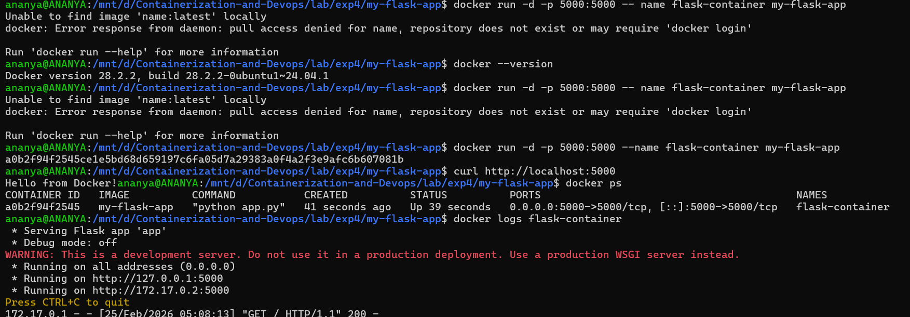

---

Step 2: Manage Containers

- Stop container
```bash
docker stop flask-container
```
- Start stopped container
```bash
docker start flask-container
```

- Remove container
```bash
docker rm flask-container
```

- Remove container forcefully
```bash
docker rm -f flask-container
```
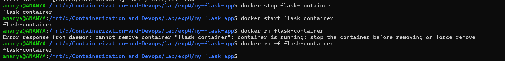

---

## Part 5: Multi-stage Builds

Step 1: Why Multi-stage Builds?

· Smaller final image size
· Better security (remove build tools)
· Separate build and runtime environments

---

Step 2: Simple Multi-stage Dockerfile


```bash
# STAGE 1: Builder stage
FROM python:3.9-slim AS builder

WORKDIR /app

# Copy requirements
COPY requirements.txt .

# Install dependencies in virtual environment
 RUN python -m venv /opt/venv
ENV PATH="/opt/venv/bin:$PATH"
RUN pip install --no-cache-dir -r requirements.txt

# STAGE 2: Runtime stage
FROM python:3.9-slim

WORKDIR /app

# Copy virtual environment from builder
COPY --from=builder /opt/venv /opt/venv
ENV PATH="/opt/venv/bin:$PATH"

# Copy application code
COPY app.py .

# Create non-root user
RUN useradd -m -u 1000 appuser
USER appuser

# Expose port
EXPOSE 5000

# Run application
CMD ["python", "app.py"]
```

---
Step 3: Build and Compare

- Build regular image
```bash
docker build -t flask-regular .
```
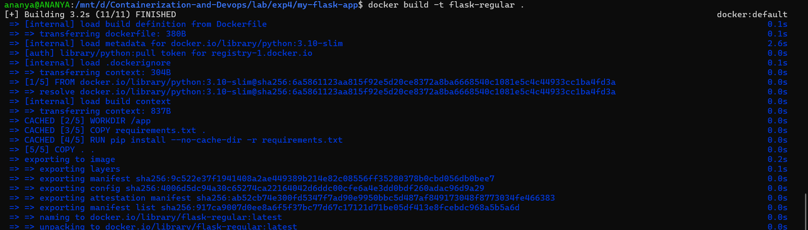

- Build multi-stage image
```bash
docker build -f Dockerfile.multistage -t flask-multistage .
```
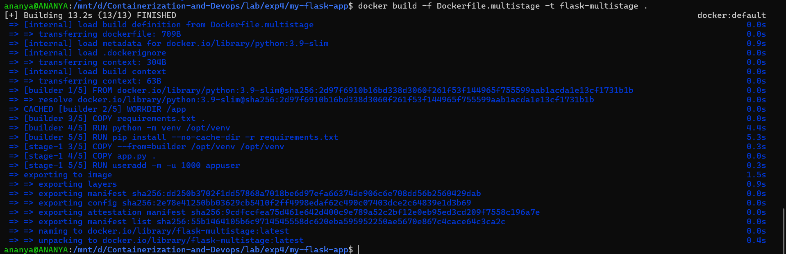
- Compare sizes
```bash
docker images | grep flask-
```
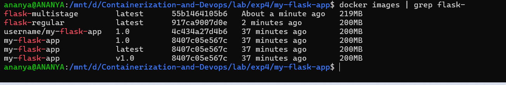

---

## Part 6: Publishing to Docker Hub

Step 1: Prepare for Publishing

- Login to Docker Hub
```bash
docker login
```

- Tag image for Docker Hub
```bash
docker tag my-flask-app:latest username/my-flask-app:1.0
docker tag my-flask-app:latest username/my-flask-app:latest
```

- Push to Docker Hub
```bash
docker push username/my-flask-app:1.0
docker push username/my-flask-app:latest
```
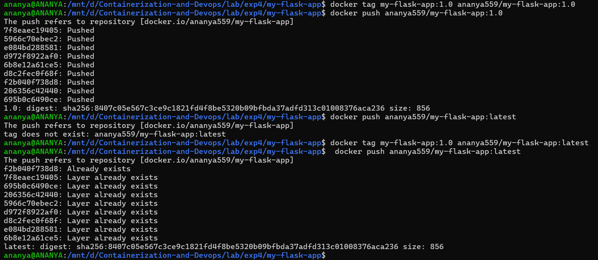

---

Step 2: Pull and Run from Docker Hub

- Pull from Docker Hub (on another machine)
```bash
docker pull username/my-flask-app:latest
```

- Run the pulled image
```bash
docker run -d -p 5000:5000 username/my-flask-app:latest
```
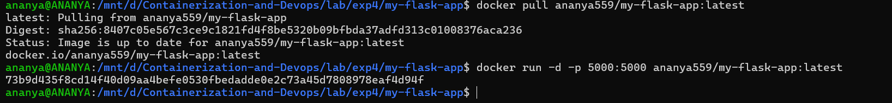

---
## Part 7: Node.js Example

Step 1: Node.js Application
```bash
mkdir my-node-app
cd my-node-app
```
[app. js](./my-node-app/app.js)
```bash
const express = require('express');
const app = express ();
const port = 3000;

app.get('/', (req, res) => {
res. send( 'Hello from Node. js Docker!');

});

app.get('/health', (req, res) => {
res.json({ status: 'healthy' });

});

});

app.listen(port, () => {
console. log( Server running on port ${port}' );
```
[package.json](./my-node-app/package.json)
```bash
{
  "name": "node-docker-app",
  "version": "1.0.0",
  "main": "app.js",
  "dependencies": {
    "express": "^4.18.2"
  }
}
```
---

Step 2: [Node.js Dockerfile](./my-node-app/Dockerfile)
```bash
FROM node: 18-alpine

WORKDIR /app

COPY package *. json . /
RUN npm install -- only=production

COPY app.js .

EXPOSE 3000

CMD ["node", "app.js"]
```
---

Step 3: Build and Run

- Build image
```bash
docker build -t my-node-app .
```
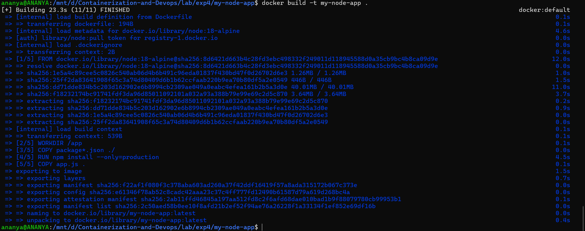
- Run container
```bash
docker run -d -p 3000:3000 --name node-container my-node-app
```

- Test
```bash
curl http://localhost:3000
```
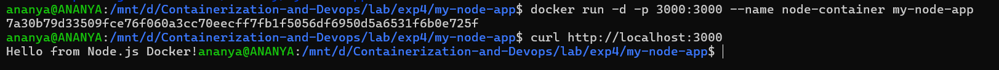
