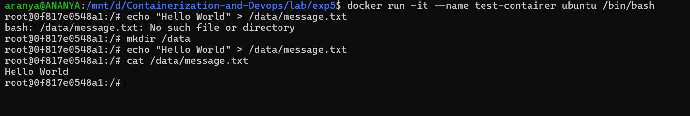
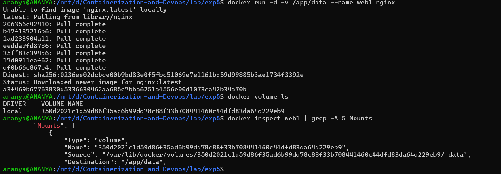
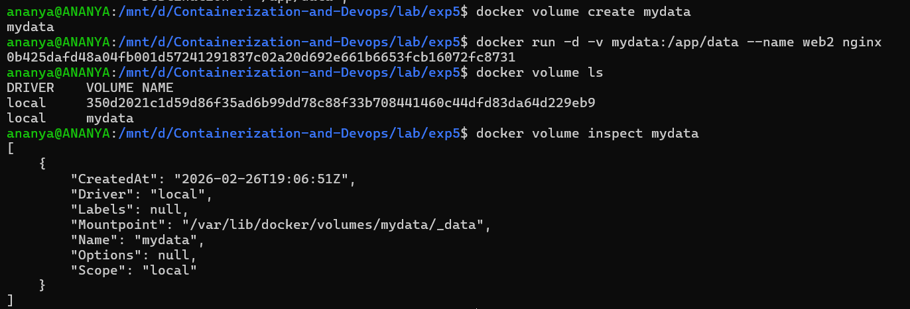
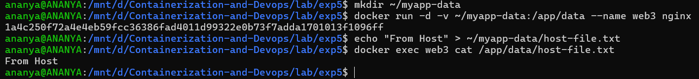

# Experiment 5: Docker - Volumes, Environment Variables, Monitoring & Networks

## Part 1: Docker Volumes - Persistent Data Storage

### Understanding Data Persistence

The Problem: Container Data is Ephemeral

1. Create a container that writes data
```bash
docker run -it --name test-container ubuntu /bin/bash
```

2. Inside container:
```bash
echo "Hello World" > /data/message.txt
cat /data/message.txt # Shows "Hello World"
exit
```


3. Restart container
```bash
docker start test-container
docker exec test-container cat /data/message.txt
# ERROR: File doesn't exist! Data was lost.
```
### Lab 2: Volume Types

1. Anonymous Volumes

- Create anonymous volume (auto-generated name)
```bash
docker run -d -v /app/data --name web1 nginx
```
- Check volume
```bash
docker volume ls
# Shows: anonymous volume with random hash
```
- Inspect container to see volume mount
```bash
docker inspect web1 | grep -A 5 Mounts
```


2. Named Volumes

- Create named volume
```bash
docker volume create mydata
```
- Use named volume
```bash
docker run -d -v mydata:/app/data --name web2 nginx
```
- List volumes
```bash
docker volume ls
# Shows: mydata
```
- Inspect volume
```bash
docker volume inspect mydata
```


3. Bind Mounts (Host Directory)

- Create directory on host
```bash
mkdir ~/myapp-data
```
- Mount host directory to container
```bash
docker run -d -v ~/myapp-data:/app/data --name web3 nginx
```
- Add file on host
```bash
echo "From Host" > ~/myapp-data/host-file.txt
```
- Check in container
```bash
docker exec web3 cat /app/data/host-file.txt
# Shows: From Host
```
