# Experiment 5: Docker - Volumes, Environment Variables, Monitoring & Networks

## Part 1: Docker Volumes - Persistent Data Storage

### Understanding Data Persistence

The Problem: Container Data is Ephemeral

1. Create a container that writes data
```bash
docker run -it --name test-container ubuntu /bin/bash
```

2. Inside container:
```bash
echo "Hello World" > /data/message.txt
cat /data/message.txt # Shows "Hello World"
exit
```


3. Restart container
```bash
docker start test-container
docker exec test-container cat /data/message.txt
# ERROR: File doesn't exist! Data was lost.
```
### Lab 2: Volume Types

1. Anonymous Volumes

- Create anonymous volume (auto-generated name)
```bash
docker run -d -v /app/data --name web1 nginx
```
- Check volume
```bash
docker volume ls
# Shows: anonymous volume with random hash
```
- Inspect container to see volume mount
```bash
docker inspect web1 | grep -A 5 Mounts
```


2. Named Volumes

- Create named volume
```bash
docker volume create mydata
```
- Use named volume
```bash
docker run -d -v mydata:/app/data --name web2 nginx
```
- List volumes
```bash
docker volume ls
# Shows: mydata
```
- Inspect volume
```bash
docker volume inspect mydata
```


3. Bind Mounts (Host Directory)

- Create directory on host
```bash
mkdir ~/myapp-data
```
- Mount host directory to container
```bash
docker run -d -v ~/myapp-data:/app/data --name web3 nginx
```
- Add file on host
```bash
echo "From Host" > ~/myapp-data/host-file.txt
```
- Check in container
```bash
docker exec web3 cat /app/data/host-file.txt
# Shows: From Host
```


### Lab 3: Practical Volume Examples

Example 1: Database with Persistent Storage

- MySQL with named volume
```bash
docker run -d \
--name mysql-db \
-v mysql-data:/var/lib/mysql \
-e MYSQL_ROOT_PASSWORD=secret \
mysql:8.0
```
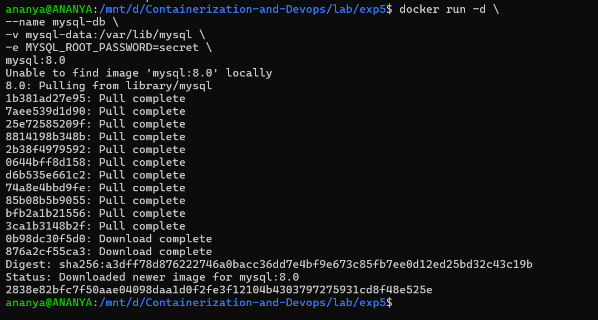
- Check data persists
```bash
docker stop mysql-db
docker rm mysql-db
```
- New container with same volume
```bash
docker run -d \
--name new-mysql \
-v mysql-data:/var/lib/mysql \
-e MYSQL_ROOT_PASSWORD=secret \
mysql:8.0
```
- Data is preserved!
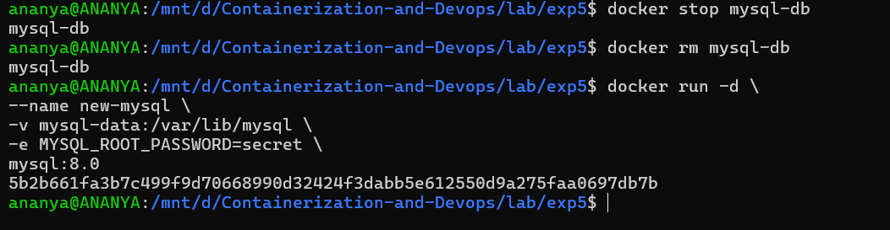

Example 2: Web App with Configuration Files
```bash
# Create config directory
mkdir ~/nginx-config

# Create nginx config file
echo 'server {
    listen 80;
    server_name localhost;
    location / {
        return 200 "Hello from mounted config!";
    }
}' > ~/nginx-config/nginx.conf

# Run nginx with config bind mount
docker run -d \
  --name nginx-custom \
  -p 8080:80 \
  -v ~/nginx-config/nginx.conf:/etc/nginx/conf.d/default.conf \
  nginx

# Test
curl http://localhost:8080
```
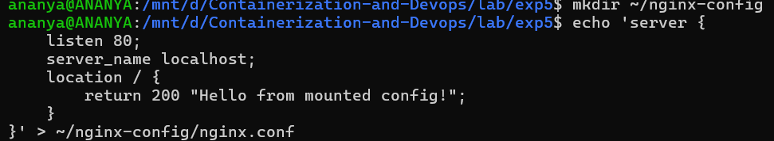
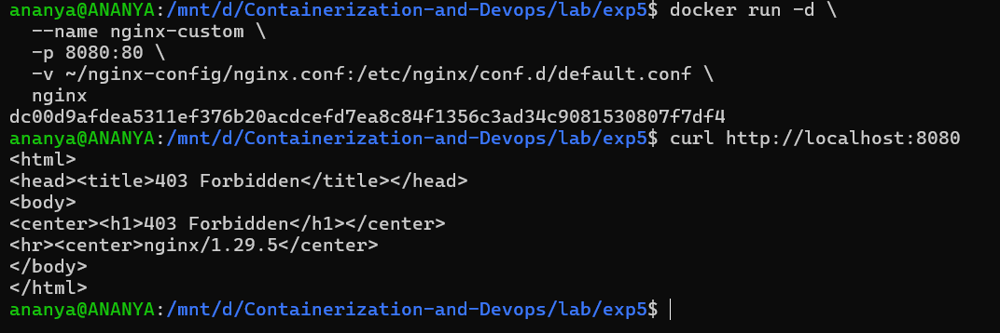

### Lab 4: Volume Management Commands
```bash
# List all volumes
docker volume ls

# Create a volume
docker volume create app-volume

# Inspect volume details
docker volume inspect app-volume

# Remove unused volumes
docker volume prune

# Remove specific volume
docker volume rm volume-name

# Copy files to/from volume
docker cp local-file.txt container-name:/path/in/volume 
```
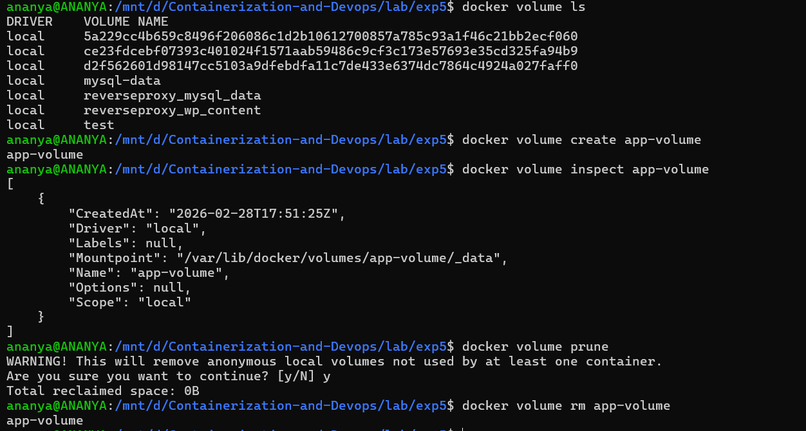

---
---

## Part 2: Environment Variables

### Lab 1: Setting Environment Variables

Method 1: Using -e flag
```bash
# Single variable
docker run -d \
--name app1 \
-e DATABASE_URL="postgres://user:pass@db:5432/mydb" \
-e DEBUG="true" \
-p 3000:3000 \
my-node-app

# Multiple variables
docker run -d \
  -e VAR1=value1 \
  -e VAR2=value2 \
  -e VAR3=value3 \
  my-node-app
```
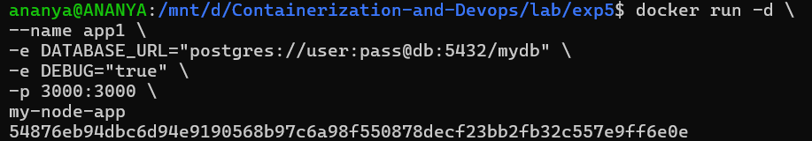
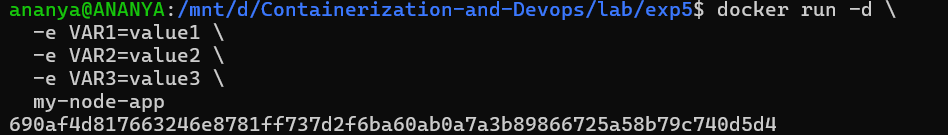

Method 2: Using -- env-file
```bash
# Create .env file
echo "DATABASE_HOST=localhost" > .env
echo "DATABASE_PORT=5432" >> .env
echo "API_KEY=secret123" >> .env

# Use env file
docker run -d \
  --env-file .env \
  --name app2 \
  my-app
```
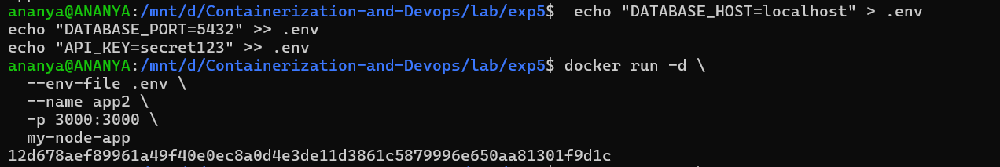
```bash
# Use multiple env files
docker run -d \
  --env-file .env \
  --env-file .env.secrets \
  my-app
```
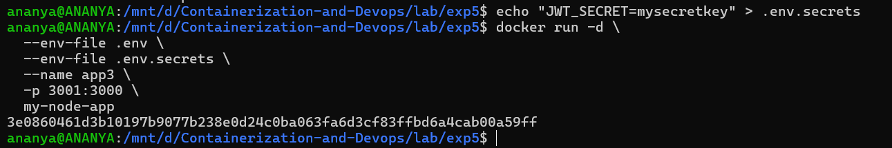

Method 3: In Dockerfile
```bash
# Set default environment variables
ENV NODE_ENV=production
ENV PORT=3000
ENV APP_VERSION=1.0.0

# Can be overridden at runtime
```
### Lab 2: Environment Variables in Applications

Python Flask Example : 
1. Create [app.py](./app.py)
```bash
# app.py
import os
from flask import Flask

app = Flask(__name__)

# Read environment variables
db_host = os.environ.get('DATABASE_HOST', 'localhost')
debug_mode = os.environ.get('DEBUG', 'false').lower() == 'true'
api_key = os.environ.get('API_KEY')

@app.route('/config')
def config():
    return {
        'db_host': db_host,
        'debug': debug_mode,
        'has_api_key': bool(api_key)
    }

if __name__ == '__main__':
    port = int(os.environ.get('PORT', 5000))
    app.run(host='0.0.0.0', port=port, debug=debug_mode)
```
2. Create [Dockerfile](./Dockerfile) with Environment Variables
```bash
FROM python:3.9-slim

# Set environment variables at build time
ENV PYTHONUNBUFFERED=1
ENV PYTHONDONTWRITEBYTECODE=1

WORKDIR /app

COPY requirements.txt .
RUN pip install -r requirements.txt

COPY app.py .

# Default runtime environment variables
ENV PORT=5000
ENV DEBUG=false

EXPOSE 5000

CMD ["python", "app.py"]
```
Lab 3: Test Environment Variables
```bash
# Run with custom env vars
docker run -d \
  --name flask-app \
  -p 5001:8080 \
  -e DATABASE_HOST="prod-db.example.com" \
  -e DEBUG="true" \
  -e PORT="8080" \
  flask-app

# Check environment in running container
docker exec flask-app env
docker exec flask-app printenv DATABASE_HOST

# Test the endpoint
curl http://localhost:5001/config
```
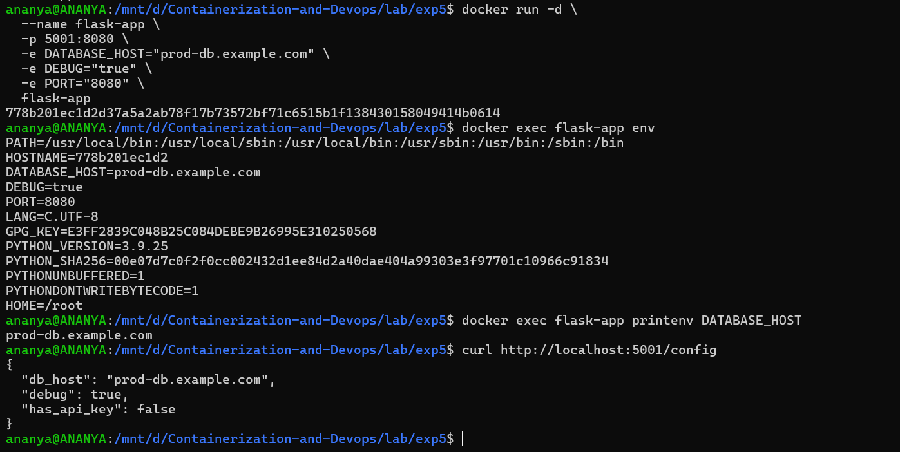

---
---
## Part 3: Docker Monitoring

### Lab 1: Basic Monitoring Commands

- Real-time Container Metrics
```bash
# Live stats for all containers
docker stats
```
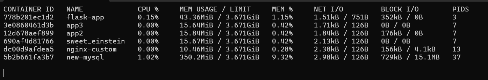
```bash
# Live stats for specific containers
docker stats container1 container2
```
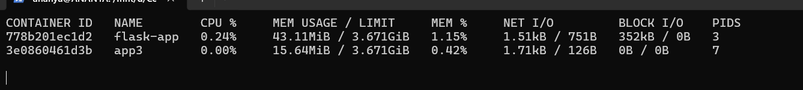
```bash
# Specific format output
docker stats -- format "table { { . Name}}\t{ { .CPUPerc}}\t{ { .MemUsage}}\t{ { . NetIO}}"
```
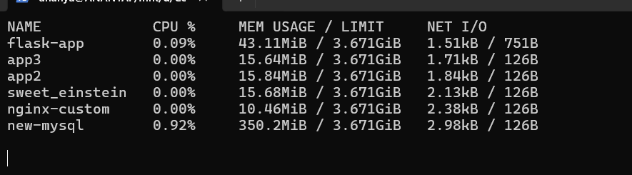
```bash
# No-stream (single snapshot)
docker stats --no-stream
```
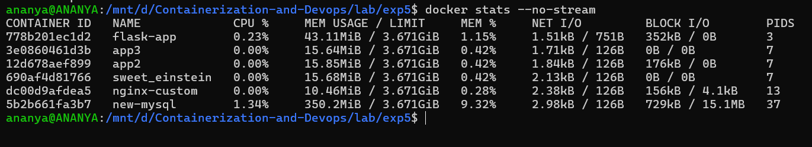

```bash
# All containers (including stopped)
docker stats --all
```
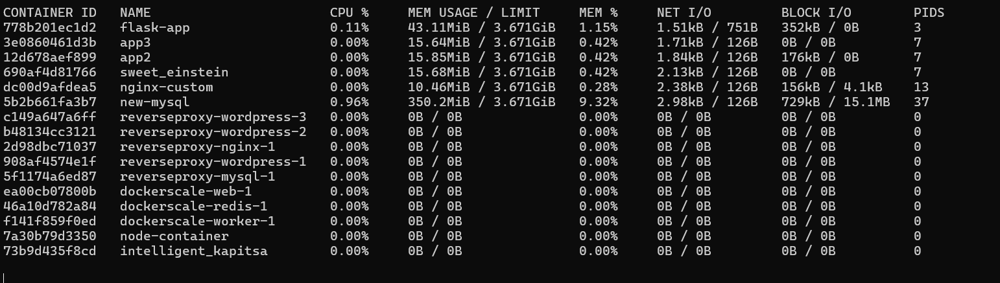

Useful Format Options:
```bash
# Custom format
docker stats -- format "Container: {{ .Name}} | CPU: { { . CPUPerc}} | Memory: { { .MemPerc} }"
```
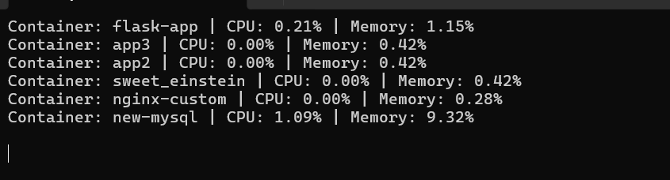
```bash
# JSON output
docker stats --format json --no-stream
```
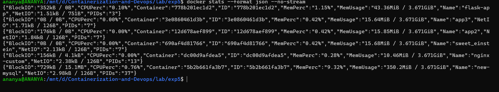
```bash
# Wide output
docker stats --no-stream --no-trunc
```
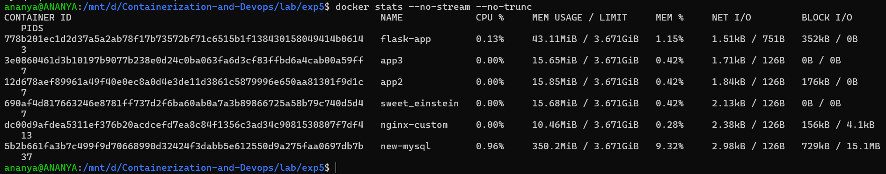

### Lab 2: docker top - Process 
```bash
# View processes in container
docker top container-name

# View with full command line
docker top container-name -ef

# Compare with host processes
ps aux | grep docker
```
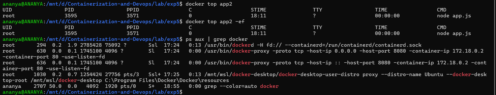

### Lab 3: docker logs - Application Logs
```bash
# View logs
docker logs container-name

# Follow logs (like tail -f)
docker logs -f container-name

# Last N lines
docker logs -- tail 100 container-name

# Logs with timestamps
docker logs -t container-name
```
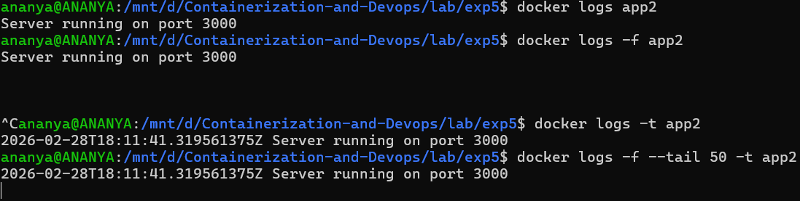

### Lab 4: Container Inspection
```bash
# Detailed container info
docker inspect container-name
```
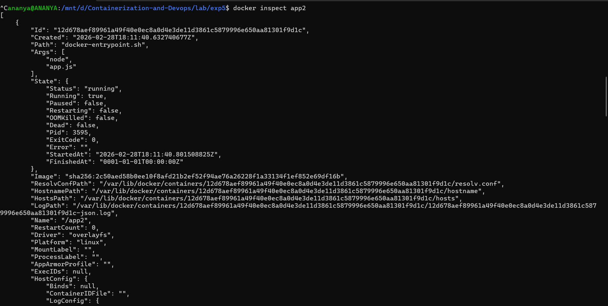
```bash
# Specific information
docker inspect -- format='{{.State.Status}}' container-name
docker inspect -- format='{ {.NetworkSettings. IPAddress}}' container-name
docker inspect -- format='{ {.Config. Env}}' container-name

# Resource limits
docker inspect -- format='{ {.HostConfig.Memory}}' container-name
docker inspect -- format='{ { .HostConfig. NanoCpus}}' container-name
```