# Experiment 6 A Title: Comparison of Docker Run and Docker Compose

## PART A -THEORY

**1. Objective**

- To understand the relationship between docker run and Docker Compose, and to compare their configuration syntax use cases.

**2. Background Theory**

2.1 Docker Run (Imperative Approach) : The docker run command is used to create and start a container from an image. It requires explicit flags for:

- Port mapping (-p)
- Volume mounting (-v)
- Environment variables (-e)
- Network configuration (-- network)
- Restart policies (--restart)
- Resource limits (--memory,--cpus)
- Container name (--name)


This approach is imperative, meaning you specify step-by-step instructions.

Example :
```bash
docker run -d \
  --name my-nginx \
  -p 8080:80 \
  -v ./html:/usr/share/nginx/html \
  -e NGINX_HOST=localhost \
  --restart unless-stopped \
  nginx:alpine
```

2.2 Docker Compose (Declarative Approach)

Docker Compose uses a YAML file (docker-compose.yml)to define services, networks, and volumes in a structured format.

Instead of multiple docker run commands, a single command is used:
```bash
docker compose up -d
```
Compose is declarative, meaning you define the desired state of the application.

Equivalent Compose file :
```bash
version: '3.8'

services:
  nginx:
    image: nginx:alpine
    container_name: my-nginx
    ports:
      - "8080:80"
    volumes:
      - ./html:/usr/share/nginx/html
    environment:
      NGINX_HOST: localhost
    restart: unless-stopped
```

**3. Mapping: Docker Run vs Docker Compose**

| Docker Run Flag              | Docker Compose Equivalent                  |
|-----------------------------|-------------------------------------------|
| -p 8080:80                  | ports:                                    |
| -v host:container           | volumes:                                  |
| -e KEY=value                | environment:                              |
| --name                      | container_name:                           |
| --network                   | networks:                                 |
| --restart                   | restart:                                  |
| --memory                    | deploy.resources.limits.memory            |
| --cpus                      | deploy.resources.limits.cpus              |
| -d                          | docker compose up -d                      |


**4. Advantages of Docker Compose :**

1. Simplifies multi-container applications
2. Provides reproducibility
3. Version controllable configuration
4. Unified lifecycle management
5. Supports service scaling

Example:
```bash
docker compose up -- scale web=3
```


## PART B - PRACTICAL TASK

### TASK 1. Single Container Comparison

Step 1: Run Nginx Using Docker Run

Execute :
```bash
docker run -d \
 --name lab-nginx \
 -p 8081:80 \
 -v $(pwd)/html:/usr/share/nginx/html \
 nginx:alpine
 ```
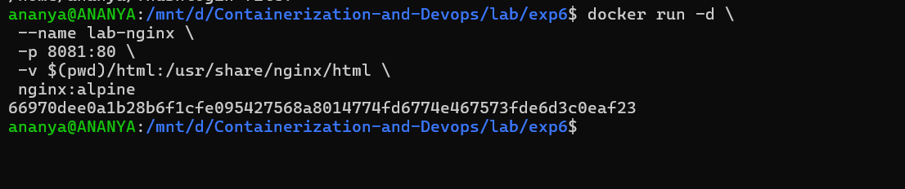

Verify :
```bash
docker ps
```
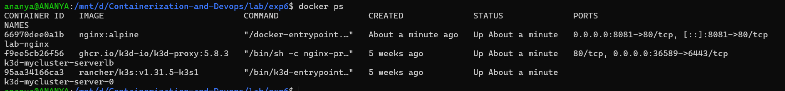

Access :
```bash
http://localhost:8082
```
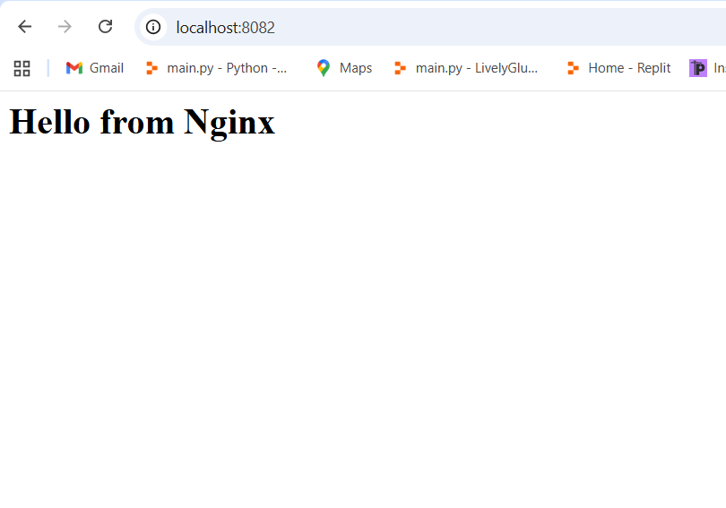

Stop and Remove :
```bash
docker stop lab-nginx
docker rm lab-nginx
```

Step 2: Run Same Setup Using Docker Compose

Create [docker-compose.yml](./docker-compose.yml)
```bash
version: '3.8'

services:
  nginx:
    image: nginx:alpine
    container_name: lab-nginx
    ports:
      - "8082:80"
    volumes:
      - ./html:/usr/share/nginx/html
```

Run :
```bash
docker compose up -d
```
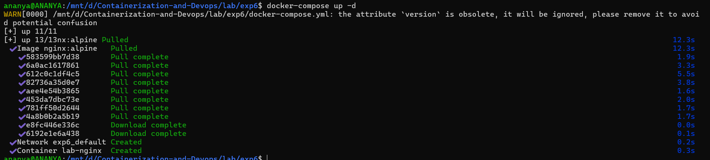

Verify :
```bash
docker compose ps
```
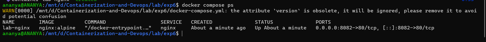

Stop :
```bash
docker compose down
```
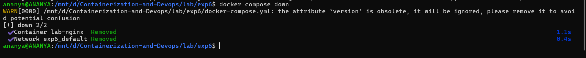


### Task 2. Multi-Container Application

Objective:

Deploy WordPress with MySQL using:

1. Docker Run (manual way)
2. Docker Compose (structured way)

A. Using Docker Run

1. Create network:
```bash
docker network create wp-net
```
2. Run MySQL:
```bash
docker run -d \
-- name mysql \
-- network wp-net \
-e MYSQL_ROOT_PASSWORD=secret \
-e MYSQL_DATABASE=wordpress \
mysql:5.7
```
3. Run WordPress :
```bash
docker run -d \
  --name wordpress \
  --network wp-net \
  -p 8082:80 \
  -e WORDPRESS_DB_HOST=mysql \
  -e WORDPRESS_DB_PASSWORD=secret \
  wordpress:latest
```
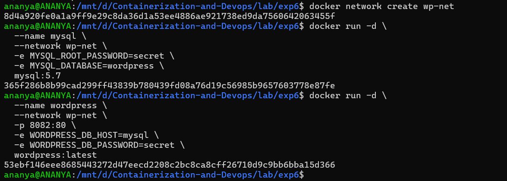

4. Test :
```bash
http://localhost:8082
```


B. Using Docker Compose

1. Create [docker-compose.yml](./docker-compose2.yml)

```bash
version: '3.8'

services:
  mysql:
    image: mysql:5.7
    environment:
      MYSQL_ROOT_PASSWORD: secret
      MYSQL_DATABASE: wordpress
    volumes:
      - mysql_data:/var/lib/mysql

  wordpress:
    image: wordpress:latest
    ports:
      - "8083:80"
    environment:
      WORDPRESS_DB_HOST: mysql
      WORDPRESS_DB_PASSWORD: secret
    depends_on:
      - mysql

volumes:
  mysql_data:
```

2. Run :
```bash
docker compose up -d
```
3. Stop :
```bash
docker compose -f docker-compose2.yml down
```
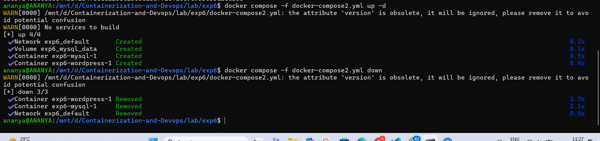

## PART C – CONVERSION & BUILD-BASED TASKS

### Task 3: Convert Docker Run to Docker Compose

Problem 1: Basic Web Application

Given Docker Run Command:
```bash

docker run -d \
  --name webapp \
  -p 5000:5000 \
  -e APP_ENV=production \
  -e DEBUG=false \
  --restart unless-stopped \
  node:18-alpine
```
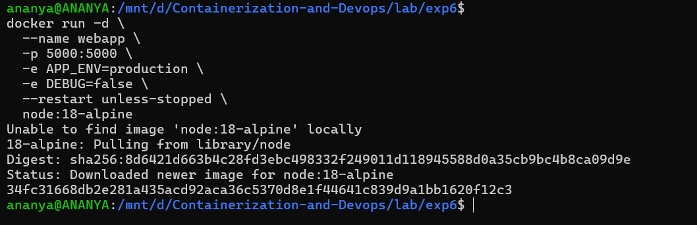


Equivalent [docker-compose.yml](./docker-compose3.yml)
```bash
version: '3.8'

services:
  webapp:
    image: node:18-alpine
    container_name: webapp2
    ports:
      - "5000:5000"
    environment:
      APP_ENV: production
      DEBUG: "false"
    restart: unless-stopped
```

- Run :
```bash
docker compose -f docker-compose3.yml up -d
```
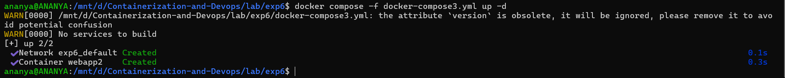

- Stop :
```bash
docker compose -f docker-compose3.yml down
```
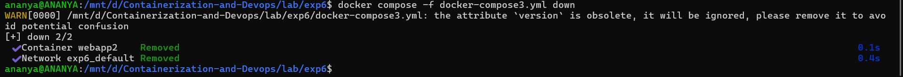

### Task 4: Resource Limits Conversion

- Given Docker Run Command:
```bash
docker run -d \
 --name limited-app \
 -p 9000:9000 \
 --memory="256m" \
 --cpus="0.5" \
 --restart always \
 nginx:alpine
 ```
 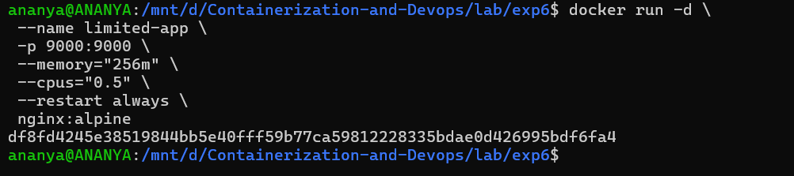

 - Equivalent [docker-compose.yml](./docker-compose4.yml):
 ```bash
 version: '3.8'

services:
  limited-app:
    image: nginx:alpine
    container_name: limited-app
    ports:
      - "9000:9000"
    restart: always
    deploy:
      resources:
        limits:
          memory: 256M
          cpus: "0.5"
```

-  Run :
```bash
docker compose -f docker-compose4.yml up -d
```

- Stop
```bash
docker compose -f docker-compose4.yml down
```
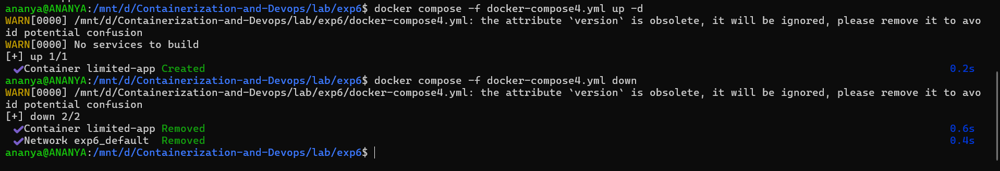

## PART D – USING DOCKERFILE INSTEAD OF STANDARD IMAGE

### Task 5: Replace Standard Image with Dockerfile (Node App)

1. Create project folder

```bash
mkdir node-docker-lab
cd node-docker-lab
```
2. Create [app.js](./node-docker-lab/app.js)

3. Create [Dockerfile](./node-docker-lab/Dockerfile)
```bash
FROM node:18-alpine

WORKDIR /app

COPY app.js .

EXPOSE 3000

CMD ["node", "app.js"]
```
4. Create [docker-compose.yml](./node-docker-lab/docker-compose.yml)
```bash
version: '3.8'
services:
 nodeapp:
 build:
 context: .
 dockerfile: Dockerfile
 container_name: custom-node-app
 ports:
 - "3000:3000"
 ```

5.  Build and run
```bash
docker compose up --build -d
```
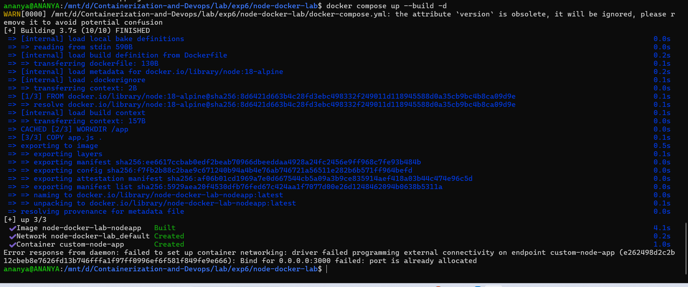

6. Check output
```bash
http://localhost:3000
```
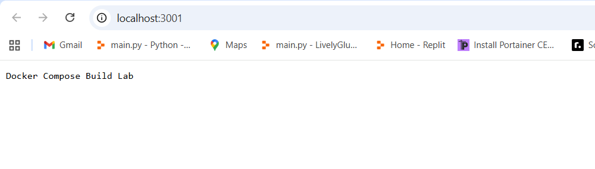

**Advanced Build Challenge**

### Task 6: Multi-Stage Dockerfile with Compose

**Requirement:**

Create a simple Python FastAPI or Node production-ready app using:

- Multi-stage Dockerfile
- Smaller final image
- Use Compose to build it

**Step 1.** Create [FastAPI app file](./app/main.py)
```bash
from fastapi import FastAPI

app = FastAPI()

@app.get("/")
def read_root():
    return {"message": "Hello from FastAPI "}
```

**Step 2.** Create [requirements.txt](./requirements.txt)
```bash
fastapi
uvicorn
```
**Step 3.** Create [Multi-Stage Dockerfile](./Dockerfile)
```bash
# Stage 1: Builder
FROM python:3.11-slim AS builder

WORKDIR /app

COPY requirements.txt .
RUN pip install --user --no-cache-dir -r requirements.txt

# Stage 2: Final (smaller image)
FROM python:3.11-slim

WORKDIR /app

# Copy only installed dependencies from builder
COPY --from=builder /root/.local /root/.local

# Add app code
COPY app ./app

# Add path for installed packages
ENV PATH=/root/.local/bin:$PATH

EXPOSE 8000

CMD ["uvicorn", "app.main:app", "--host", "0.0.0.0", "--port", "8000"]
```

**Step 4.** Create [docker-compose.yml](./docker-compose5.yml)
```bash
version: '3.8'

services:
  fastapi-app:
    build: .
    container_name: fastapi_app
    ports:
      - "8000:8000"
    restart: always
```

**Step 5.** Run the app
```bash
docker-compose up -d
```
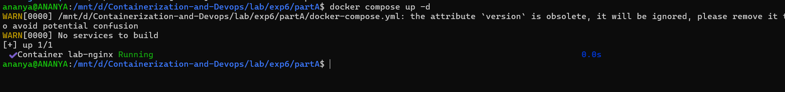