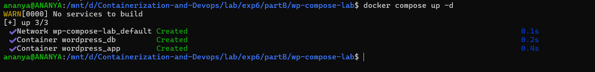
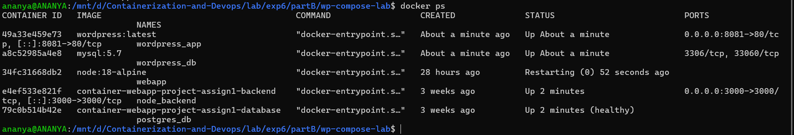
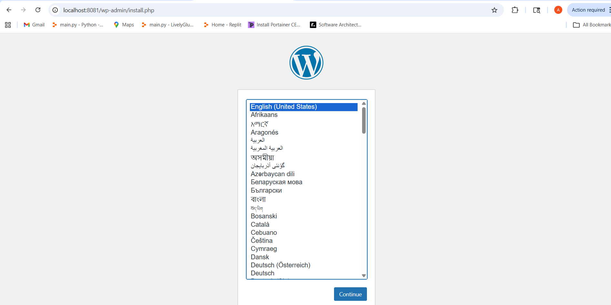
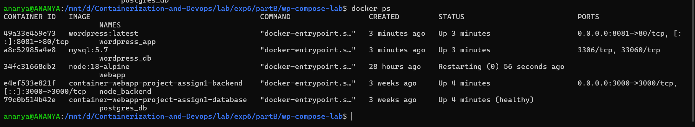
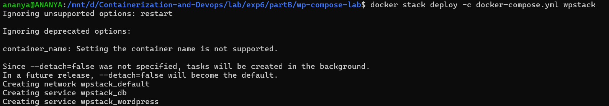
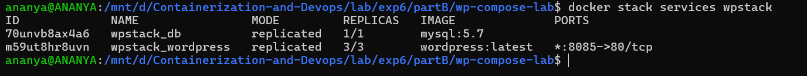
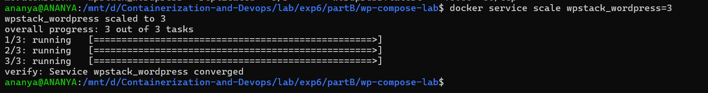

# Experiment 6 Multi-Container Application using Docker Compose (WordPress + Database) **

1. Objective :

To deploy a multi-container application using Docker Compose, consisting of:

- WordPress (frontend + PHP)
- MySQL database (backend)

Also:

- Understand container networking & volumes
- Learn how to scale services
- Compare with Docker Swarm for production deployment


2. Prerequisites

- Docker installed
- Docker Compose (comes with modern Docker)
- Basic understanding of containers


3. Architecture Overview


- WordPress connects to MySQL using service name (DNS inside Docker network)
- Data is persisted using volumes

**Steps**

Step 1: Create Project Directory
```bash
mkdir wp-compose-lab
cd wp-compose-lab
```

Step 2: Create [docker-compose.yml](./wp-compose-lab/docker-compose.yml)
```bash
version: '3.9'

services:
  db:
    image: mysql:5.7
    container_name: wordpress_db
    restart: always
    environment:
      MYSQL_ROOT_PASSWORD: rootpass
      MYSQL_DATABASE: wordpress
      MYSQL_USER: wpuser
      MYSQL_PASSWORD: wppass
    volumes:
      - db_data:/var/lib/mysql

  wordpress:
    image: wordpress:latest
    container_name: wordpress_app
    depends_on:
      - db
    ports:
      - "8080:80"
    restart: always
    environment:
      WORDPRESS_DB_HOST: db:3306
      WORDPRESS_DB_USER: wpuser
      WORDPRESS_DB_PASSWORD: wppass
      WORDPRESS_DB_NAME: wordpress
    volumes:
      - wp_data:/var/www/html

volumes:
  db_data:
  wp_data:

```
- Exposes WordPress on:
```bash
http://localhost:8080
```

Step 3: Start Application
```bash
docker-compose up -d
```


What happens:

- Images are pulled
- Network is created
- Containers are started
- DNS-based service discovery enabled

Step 4: Verify Containers
```bash
docker ps
```


Step 5: Access WordPress

Open browser:
```bash
http://localhost:8081
```


- Complete WordPress setup
- Enter site title, admin user, password

Step 6: Check Volumes
```bash
docker volume ls
```


- dbdata -> database persistence
- wpdata -> WordPress files

Step 7: Stop Application
```bash
docker-compose down
```
- Containers removed
- Volumes remain intact

**Solution: Use Reverse Proxy (Nginx)**

Add another service:
```bash
nginx:
image: nginx:latest
ports:
- "8080:80"
```

Then configure load balancing manually.

Limitations of Compose Scaling :

-  No built-in load balancing
- No auto-healing
- Single host only
- Not production-ready for scaling

6. Running Same Setup with Docker Swarm

Step 1: Initialize Swarm
```bash
docker swarm init
```

Step 2: Deploy Stack
```bash
docker stack deploy -c docker-compose.yml wpstack
```


- Check running services
```bash
docker stack services wpstack
```


Step 3: Scale Service
```bash
docker service scale wpstack_wordpress=3
```



**What Changes in Swarm?**
| Feature           | Docker Compose      | Docker Swarm        |
|------------------|--------------------|---------------------|
| Scope            | Single host        | Multi-node cluster  |
| Scaling          | Manual             | Built-in            |
| Load balancing   | No                 | Yes (internal LB)   |
| Self-healing     | No                 | Yes                 |
| Rolling updates  | No                 | Yes                 |
| Networking       | Basic              | Overlay network     |

7. Benefits of Docker Swarm

- Built-in load balancing
- Automatic container restart (self-healing)
- Horizontal scaling across nodes
- Rolling updates without downtime
- Service abstraction (not individual containers)

8. Challenges / Limitations of Swarm

- Less popular than Kubernetes
- Limited ecosystem
- Less flexible scheduling
- Fewer enterprise features

9. Key Learning Outcomes

- Multi-container apps require orchestration
- Docker Compose is ideal for:
     - Development
     - Testing
     - Learning

- Docker Swarm is useful for:
    - Simple production clusters
    - Easy scaling without Kubernetes complexity


10. Conclusion

This experiment demonstrated:

- How to deploy WordPress + MySQL using Docker Compose
- How containers communicate using internal networking
- Importance of volumes for persistence
- Scaling limitations of Compose
- Advantages of using Docker Swarm for production-ready deployments