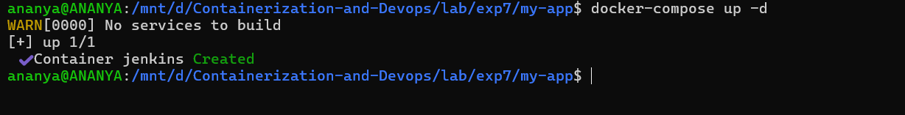
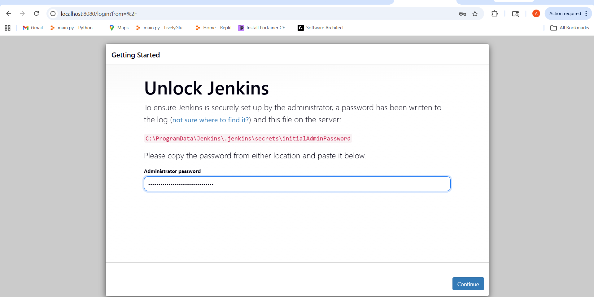
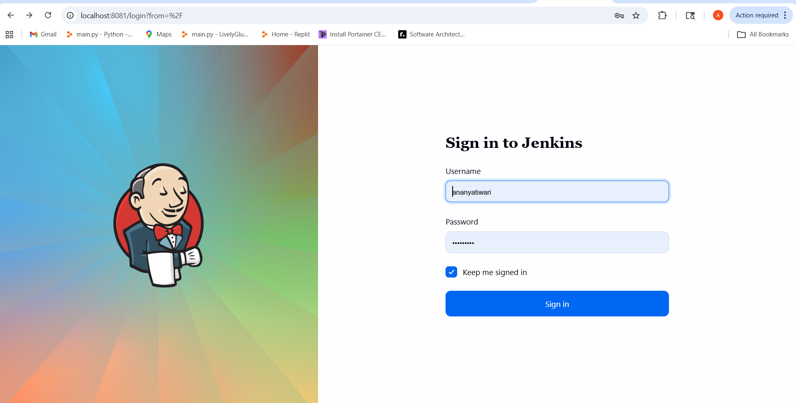
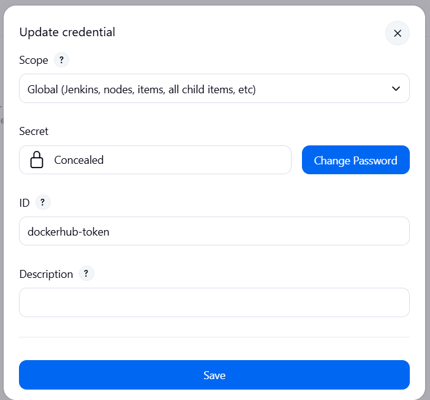

# Lab Experiment 7: CI/CD using Jenkins, GitHub and Docker Hub

## Aim

To design and implement a complete CI/CD pipeline using Jenkins, integrating source code from GitHub, and building &
pushing Docker images to Docker Hub.

## Objectives

- Understand CI/CD workflow using Jenkins (GUI-based tool)
- Create a structured GitHub repository with application + Jenkinsfile
- Build Docker images from source code
- Securely store Docker Hub credentials in Jenkins
- Automate build & push process using webhook triggers
- Use same host (Docker) as Jenkins agent

## Theory

1. What is Jenkins?

Jenkins is a web-based GUI automation server used to:

- Build applications
- Test code
- Deploy software

It provides:

- Dashboard (browser-based UI)
- Plugin ecosystem (GitHub, Docker, etc.)
- Pipeline as Code using Jenkinsfile

2. What is CI/CD?

- Continuous Integration (CI) : Code is automatically built and tested after each commit

- Continuous Deployment (CD) : Built artifacts (Docker images) are automatically delivered/deployed

3. Workflow Overview
```bash
Developer > GitHub > Webhook > Jenkins > Build > Docker Hub
```
4. Prerequisites :
- Docker & Docker Compose installed
- GitHub account
- Docker Hub account
- Basic Linux command knowledge

### Part A: GitHub Repository Setup (Source Code + Build Definition)

1. Create Repository

   Create a repository on GitHub:
```bash
my-app
```

2. Project Structure
```bash
my- app/
app . py
requirements.txt
Dockerfile
Jenkinsfile
```
3. Application Code

- Create[app.py](./my-app/app.py)
```bash
from flask import Flask
app = Flask (_name_)

@app.route("/")
def home():
return "Hello from CI/CD Pipeline!"
#return "Hello from CI/CD Pipeline!, my sapid is 123456"

app.run(host="0.0.0.0", port=80)
```
- Create [requirements.txt](./my-app/requirements.txt)
```bash
flask
```
4. Create [Dockerfile](./my-app/Dockerfile) (Build Process)
```bash
FROM python:3.10-slim

WORKDIR /app
COPY . .

RUN pip install -r requirements.txt

EXPOSE 80
CMD ["python", "app.py"]
```
Build Process Explanation :

1. Source code pushed to GitHub
2. Jenkins pulls code
3. Dockerfile:

- Creates environment
- Installs dependencies
- Packages app

4. Output -> Docker Image

5. Create [Jenkinsfile](./my-app/Jenkinsfile) (Pipeline Definition in GitHub)
```bash
pipeline {
    agent any

    environment {
        IMAGE_NAME = "your-dockerhub-username/myapp"
    }

    stages {

        stage('Clone Source') {
            steps {
                git 'https://github.com/your-username/my-app.git'
            }
        }

        stage('Build Docker Image') {
            steps {
                sh 'docker build -t $IMAGE_NAME:latest .'
            }
        }

        stage('Login to Docker Hub') {
            steps {
                withCredentials([string(credentialsId: 'dockerhub-token', variable: 'DOCKER_TOKEN')]) {
                    sh 'echo $DOCKER_TOKEN | docker login -u your-dockerhub-username --password-stdin'
                }
            }
        }

        stage('Push to Docker Hub') {
            steps {
                sh 'docker push $IMAGE_NAME:latest'
            }
        }
    }
}
```
### Part B: Jenkins Setup using Docker (Persistent Configuration)

1. Create [Docker Compose](./my-app/docker-compose.yml) File
```bash
version: '3.8'

services:
jenkins:
image: jenkins/jenkins:lts
container_name: jenkins
restart: always
ports:
- "8080:8080"
- "50000:50000"
volumes:
- jenkins_home:/var/jenkins_home
- /var/run/docker.sock:/var/run/docker.sock
user: rootdocker-compose up -d

volumes:
jenkins_home:
```
2. Start Jenkins
```bash
docker-compose up -d
```


- Access :
```bash
http://localhost:8081/
```

3. Unlock Jenkins
```bash
docker exec -it jenkins cat /var/jenkins_home/secrets/initialAdminPassword
```
4. Initial Setup
- Install suggested plugins
- Create admin user


### Part C: Jenkins Configuration

1. Add Docker Hub Credentials

Path:

Manage Jenkins > Credentials > Add Credentials

- Type: Secret Text
- ID: dockerhub-token
- Value: Docker Hub Access Token


2. Create Pipeline Job

-  New Item -> Pipeline
- Name : ci-cd-pipeline

- Configure:
```bash
Pipeline script from SCM
```
- SCM: Git
- Repo URL: your GitHub repo
- Script Path : Jenkinsfile