# Experiment 9 : Ansible

**Theory**

Problem Statement: Managing infrastructure manually across multiple servers leads to configuration drift, inconsistent
environments, and time-consuming repetitive tasks. Scaling from one server to hundreds becomes nearly impossible with
manual SSH-based administration.

What is Ansible?

- Ansible is an open-source automation tool for configuration management, application deployment, and
orchestration.
- It follows an agentless architecture, using SSH for Linux and WinRM for Windows.
- Uses YAML-based playbooks to define automation tasks.

Ansible is software that enables cross-platform automation and orchestration at scale and has become the standard
choice among enterprise automation solutions.

How Ansible Solves the Problem:

- Agentless Architecture: No software installation required on managed nodes
- Idempotency: Running playbooks multiple times yields same result
- Declarative Syntax: Describe desired state, not the steps to achieve it
- Push-based: Initiates changes from control node immediately

## Part A

   **Ansible Installation Instructions**
   1. Install ansible
   ```bash
   sudo apt update -y
   sudo apt install ansible -y
   ```
   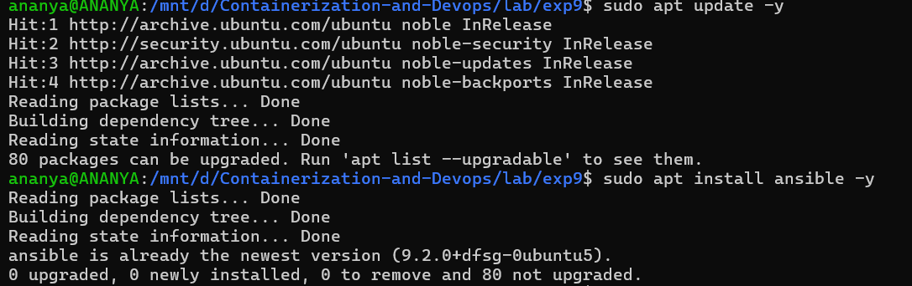

   2. Verify installation
   ```bash
    ansible --version
   ```
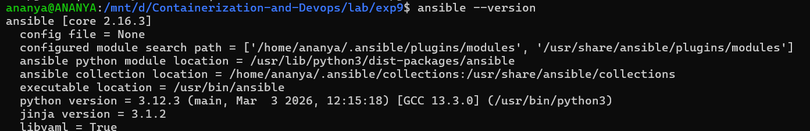

3. Post-Installation Check
```bash
# Test with a local ping
ansible localhost -m ping
```
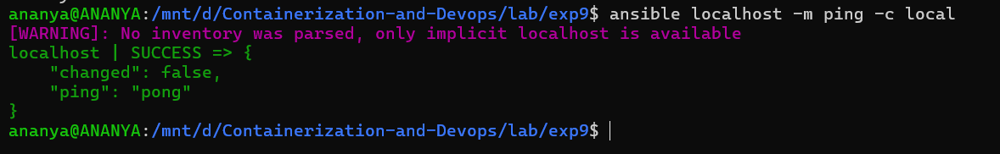
---

### Ansible Demo

Ansible demo with docker container as servers

**Create Docker image and test ssh login**

First create ssh key-pair and then create custom ubuntu-server image with open-ssh configured.

**Testing SSH Key Pair Login with Docker and WSL**

1. Create SSH Key Pair in WSL
First, generate an SSH key pair in your WSL environment:
```bash
# Generate RSA key pair (accept defaults when prompted)
ssh-keygen -t rsa -b 4096

# This creates:
# Private key: ~/.ssh/id_rsa
# Public key: ~/.ssh/id_rsa.pub
# copy keys to current directory to be added to docker images
cp ~/.ssh/id_rsa.pub .
cp ~/.ssh/id_rsa .
```
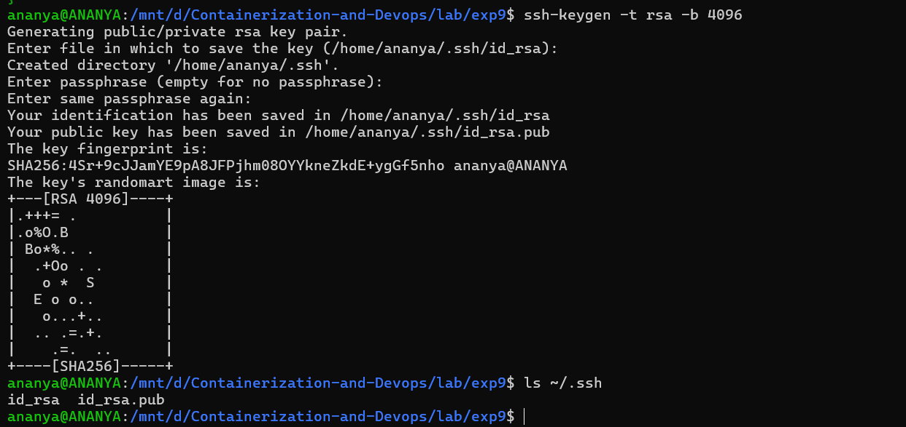

2. Create a Dockerfile for Ubuntu SSH Server
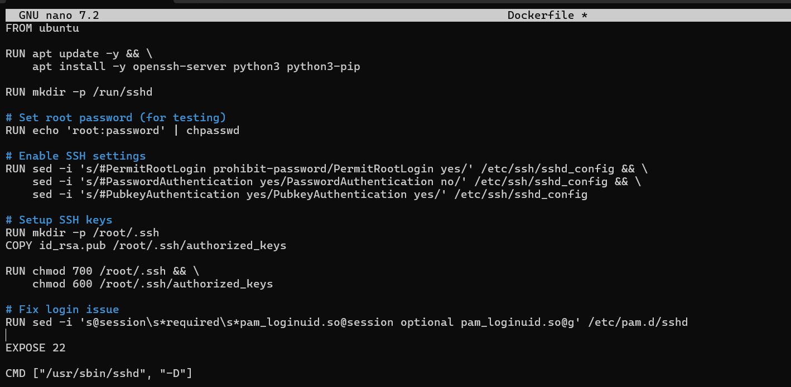

3. Build the Docker Image
```bash
# Copy your public key to the current directory
cp ~/.ssh/id_rsa.pub .

# Build the Docker image
docker build -t ubuntu-server .

# Remove the public key from build directory (optional)
rm id_rsa.pub
```
4. Run the Docker Container
```bash
# Run the container with port mapping
docker run -d -p -- rm 2222:22 -p 8221:8221 -- name ssh-test-server ubuntu-server
```
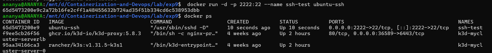

5. Find the Container IP Address
```bash
# Get the container's IP address
docker inspect -f '{{range. NetworkSettings. Networks}}{ { . IPAddress}}{ {end}}' ssh-test-server
```
- Note this IP address (e.g., 172.17.0.2)
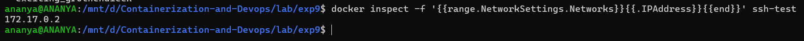

6. Test SSH Connections
- Test password authentication :
```bash
ssh root@localhost -p 2222
```
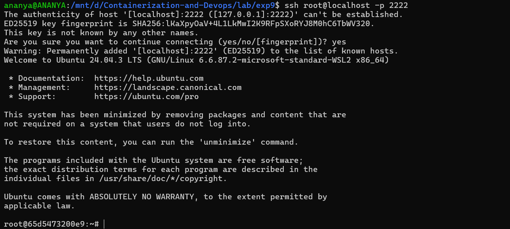

- Test key-based authentication :
```bash
ssh -i ~/.ssh/id_rsa root@localhost -p 2222
# Should log in without password prompt
```
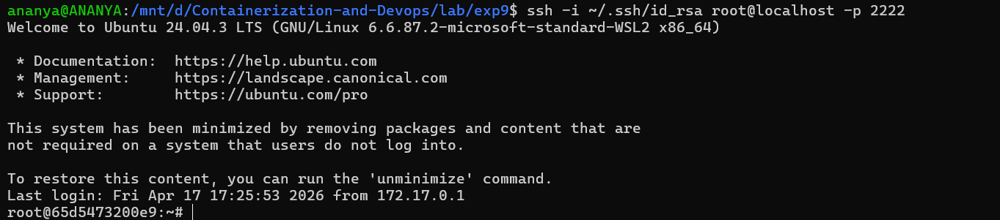

7. Alternative : Using Container IP Directly
```bash
ssh root@172.17.0.2
```
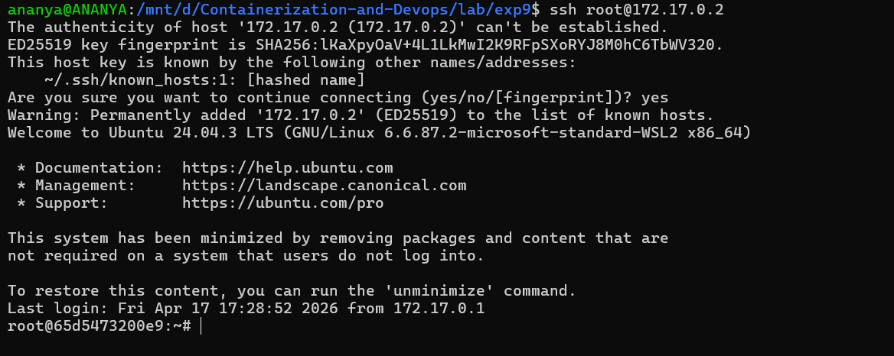

8. Cleanup

When done testing :
```bash
docker stop ssh-test
docker rm ssh-test
```
### Ansible with Docker Exercise

Using docker image ubuntu-server created in previous part run 4 test servers named server1 to serve4

1. Start multiple containers to act as server (to be configured by ansible)
```bash
for i in {1..4}; do
  echo "Creating server$i"
  docker run -d -p 220$i:22 --name server$i ubuntu-ssh
done
```
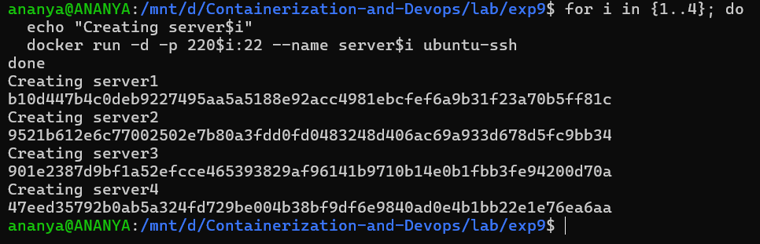


Step X: To stop all servers (if required)

for i in {1 .. 4}; do
docker stop server${i}
done

2. Create Ansible Inventory

Below script will create an update inventory.ini with updated docker container IPs.
```bash
[servers]
server1 ansible_host=127.0.0.1 ansible_port=2201
server2 ansible_host=127.0.0.1 ansible_port=2202
server3 ansible_host=127.0.0.1 ansible_port=2203
server4 ansible_host=127.0.0.1 ansible_port=2204

[servers:vars]
ansible_user=root
ansible_ssh_private_key_file=~/.ssh/id_rsa
ansible_python_interpreter=/usr/bin/python3
```
3. Review content of inventory.ini
```bash
cat inventory.ini
```
4. Test Connectivity

- Manual SSH test
```bash
ssh -i ~/.ssh/id_rsa root@localhost -p 2201
```


- Ansible ping test
```bash
ansible all -i inventory.ini -m ping
```
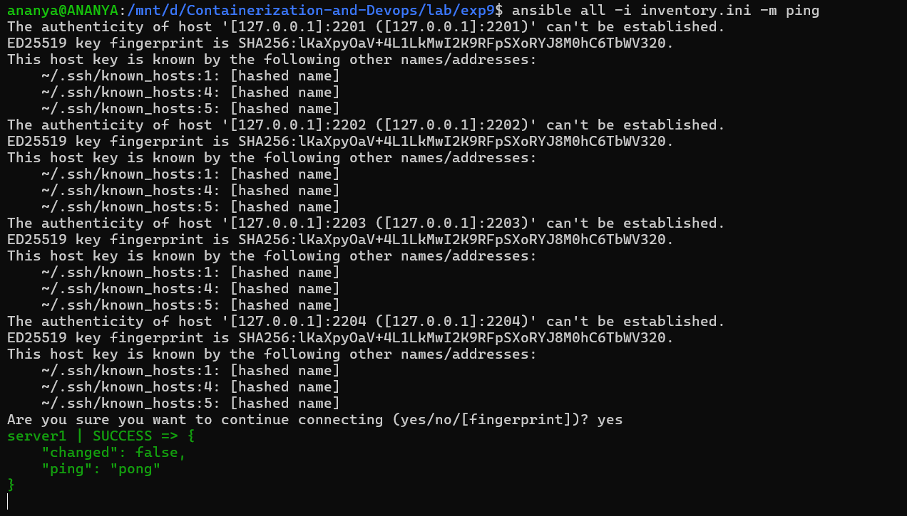

5. Create [Playbook](./playbook.yml)

The yaml file should start with three dash only ---
```bash
--- # it should start with three dash only ---
- name: Update and configure servers
hosts: all
become: yes

tasks:
- name: Update apt packages
apt:
update_cache: yes
upgrade: dist

- name: Install required packages
apt:
name: ["vim", "htop", "wget"]
state: present

- name: Create test file
copy:
dest: /root/ansible_test.txt
content: "Configured by Ansible on {{ inventory_hostname }}"
```
6. Run Playbook
```bash
ansible-playbook -i inventory.ini playbook.yml
```
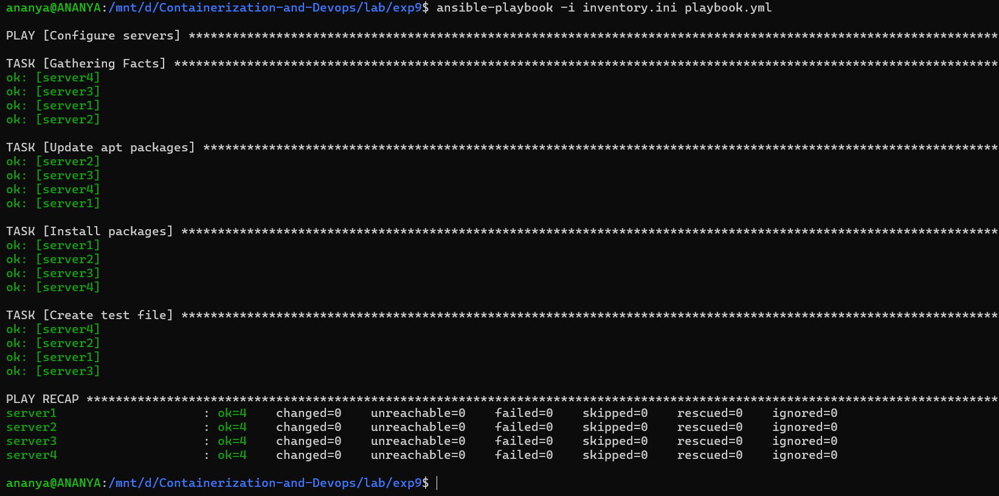

7. Verify Changes
```bash
# Using Ansible
ansible all -i inventory. ini -m command -a "cat /root/ansible_test.txt"

# Manually via Docker
for i in {1 .. 4}; do
docker exec server${i} cat /root/ansible_test.txt
done
```
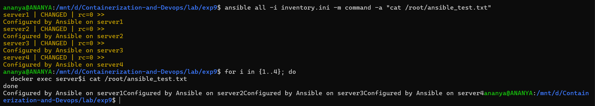

8. Cleanup
```bash
# Stop and remove containers
for i in {1..4}; do docker rm -f server${i}; done
```
---

**Trying another playbook also**


1. Create [playbook1.yml](./playbook1.yml)

The yaml file should start with three dash only ---
```bash
---
- name: Configure multiple servers
  hosts: servers
  become: yes

  tasks:
    - name: Update apt package index
      apt:
        update_cache: yes

    - name: Install Python 3 (latest available)
      apt:
        name: python3
        state: latest

    - name: Create test file with content
      copy:
        dest: /root/test_file.txt
        content: |
          This is a test file created by Ansible
          Server name: {{ inventory_hostname }}
          Current date: {{ ansible_date_time.date }}

    - name: Display system information
      command: uname -a
      register: uname_output

    - name: Show disk space
      command: df -h
      register: disk_space

    - name: Print results
      debug:
        msg:
          - "System info: {{ uname_output.stdout }}"
          - "Disk space: {{ disk_space.stdout_lines }}"
```

2. Run the playbook
```bash
ansible-playbook -i inventory.ini playbook1.yml
```
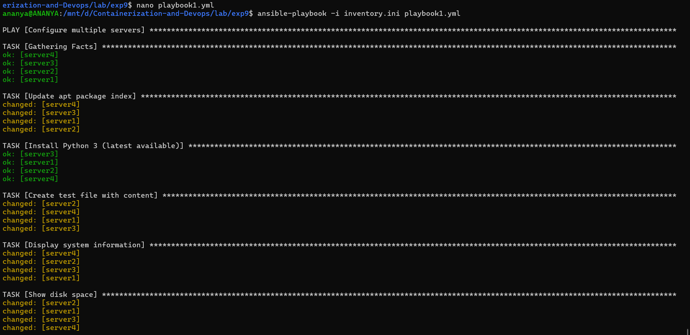

3. Verify output 
```bash
#using ansible
ansible all -i inventory.ini -m command -a "cat /root/test_file.txt"
#using docker
for i in {1..4}; do
  docker exec server$i cat /root/test_file.txt
done
```
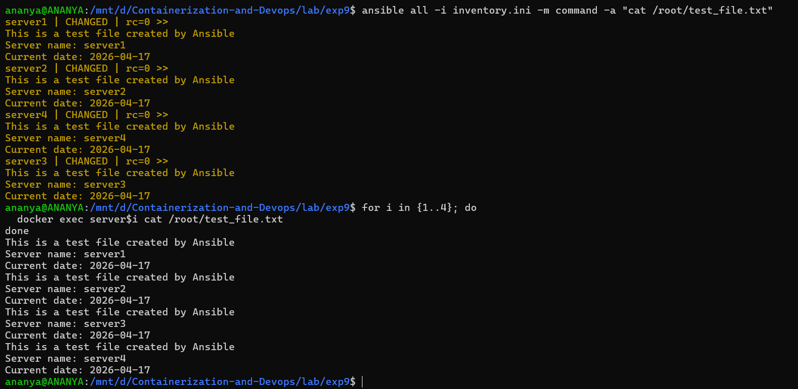

