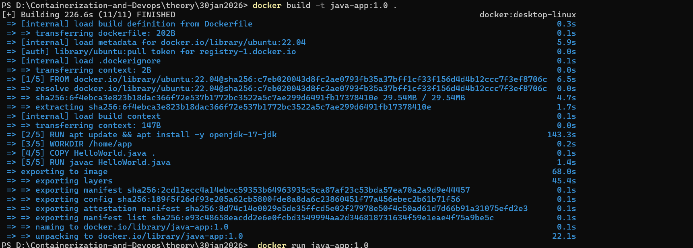
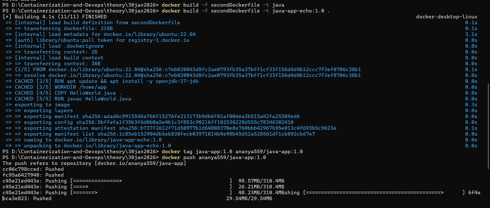
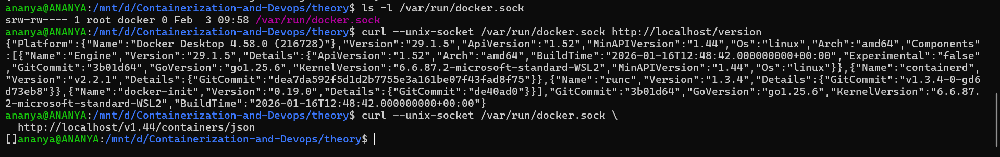
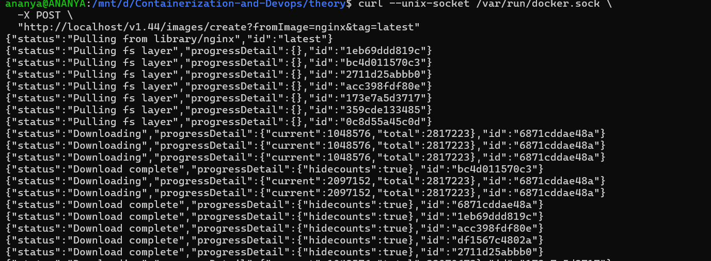

# UNIT 1
---

### WSL
1. Installing and Enabling WSL
```bash
    wsl --install -d ubuntu 
```
2. Installing Docker Engine on Ubuntu
```bash
  sudo apt update
    sudo apt install docker.io
```
3. Verify
```bash
docker -v
docker run hello-world
```
---
### Docker Basic Commands
1. To check Docker Version
```bash
    sudo docker version
```
2. To list local images
```bash
    docker images
```
3. To pull image from registry
```bash
docker pull ubuntu
```
4. To remove image
```bash
docker rmi ubuntu
```
5. To run container
```bash
docker run ubuntu
docker run -it --name test ubuntu
```bash
docker run ubuntu
docker run -it --name test ubuntu bash
```
6. List Containers
```bash
docker ps
```
---
### To Preserve Changes Made Inside A Container

1. Run base Ubuntu container.
```bash
docker run -it --name java_lab ubuntu:22.04 
```
2. Install Java compiler inside the container.
```bash
apt update
apt install -y openjdk-17-jdk
```
- Verify :
```bash
javac --version
```
3. Create Java App in /home/app.
```bash
mkdir -p /home/app
cd /home/app
```
- Create java file.
```bash
apt update
apt install -y nano
nano HelloWorld.java
```
- Compile and Run.
```bash
javac HelloWorld.java
java HelloWorld
```
4. Exit container.
```bash
exit
```
5. Convert Container to Image.
```bash
docker commit java_lab myrepo/java-app:1.0
```
6. Reuse the exported image (locally).
```bash
docker run -it myrepo/java-app:1.0 bash
```
7. Save and Load Image(Offline Transfer).
```bash
docker save -o java-app.tar myrepo/java-app:1.0
docker load -i java-app.tar
```
---
### Docker file
1. Create [java docker](./java%20docker/) with [Dockerfile](./java%20docker/Dockerfile) and [HelloWorld.java](./java%20docker/HelloWorld.java)

2. Build Image from Docker file and verify.
```bash
docker build -t java-app:1.0 .
docker images
```


3. Run container from build images.
```bash
docker run java-app:1.0
```
4. Modify CMD in [Second Docker file](./java%20docker/secondDockerfile)
```bash
CMD ["echo","Hello from version 2"]
```
5. Push to registry.
```bash
sudo docker tag java-app:1.0 ananya559/java-app:1.0
sudo docker push ananya559/java-app:1.0
```


6. Pull anywhere.
```bash
docker pull ananya559/java-app:1.0
docker run ananya559/java-app:1.0
```

### Docker Engine API

1. Verify Docker API Socket in WSL
- Inside WSL

```bash
ls -l /var/run/docker.sock
```

2. API Versioning

```bash
curl --unix-socket /var/run/docker.sock http://localhost/version
```
3. List Containers

```bash
curl --unix-socket /var/run/docker.sock \
  http://localhost/v1.44/containers/json
  ```
  

4. Pull nginx
```bash
curl --unix-socket /var/run/docker.sock \
  -X POST \
  "http://localhost/v1.44/images/create?fromImage=nginx&tag=latest"
  ```
  

5. Start/Stop Container 
```bash
   curl --unix-socket /var/run/docker.sock \
  -X POST \
  http://localhost/v1.44/containers/mynginx/start
```
```bash
  curl --unix-socket /var/run/docker.sock \
  -X POST \
  http://localhost/v1.44/containers/mynginx/stop
```