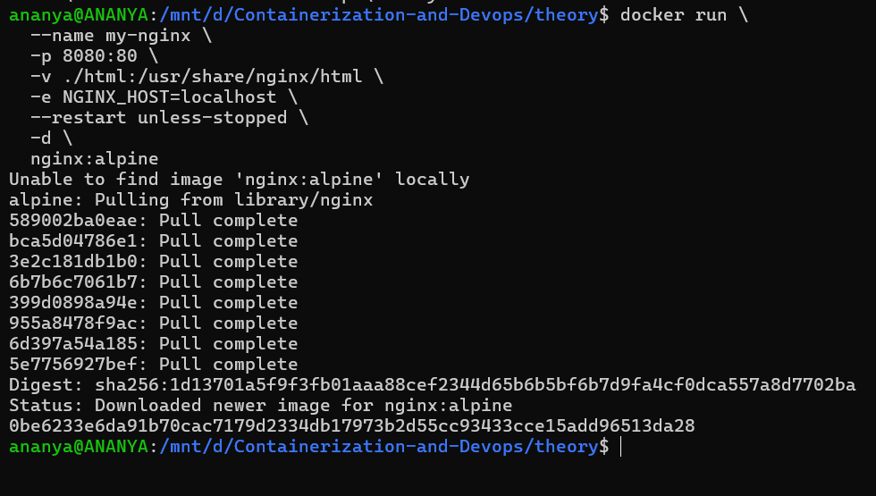
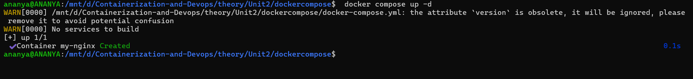
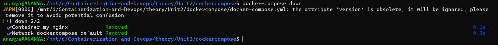
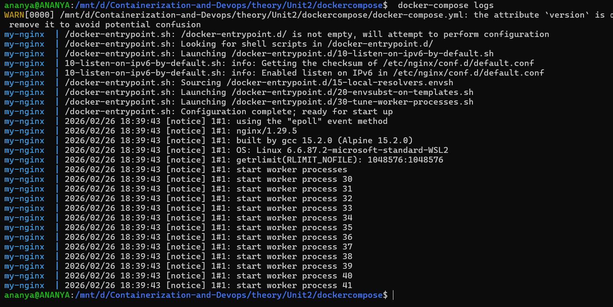
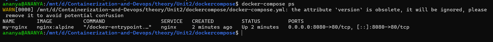
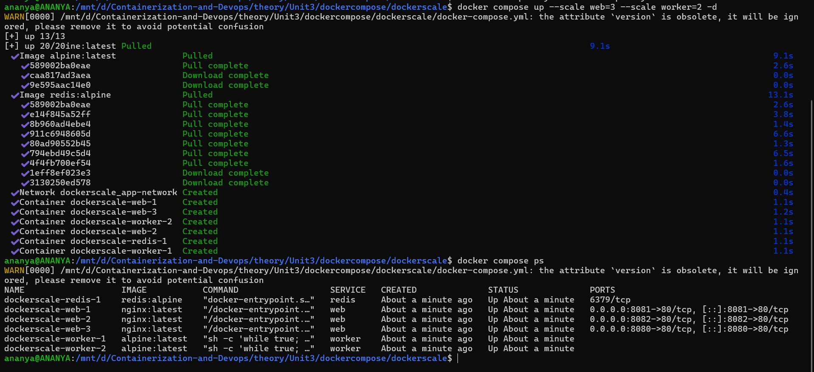
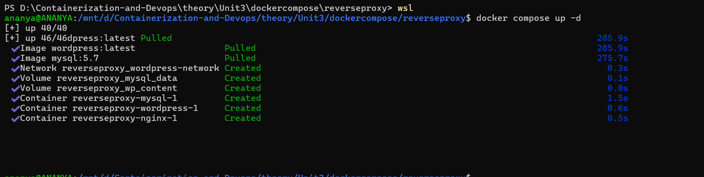
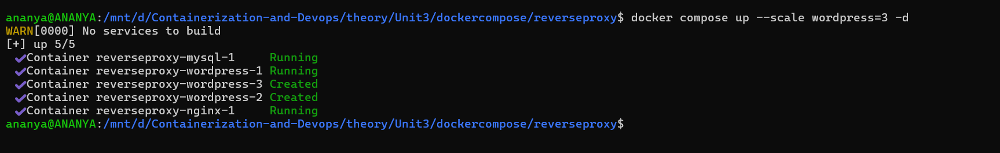
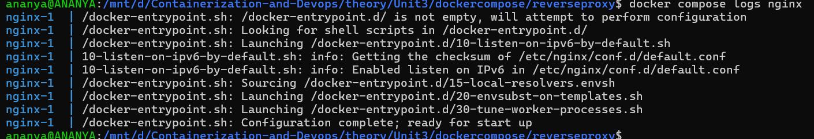

# Docker Compose vs Docker Run

1. Running Nginx with Docker Run
```bash
docker run \
  --name my-nginx \
  -p 8080:80 \
  -v ./html:/usr/share/nginx/html \
  -e NGINX_HOST=localhost \
  --restart unless-stopped \
  -d \
  nginx:alpine
```


2. Same setup with Docker Compose

- Create [docker-compose.yml](./docker-compose.yml) : 
```bash
version: '3.8'
services:
  nginx:
    image: nginx:alpine          
    container_name: my-nginx     
    ports:
      - "8080:80"              
    volumes:
      - ./html:/usr/share/nginx/html  
    environment:
      - NGINX_HOST=localhost    
    restart: unless-stopped     
```

3. Create container using Docker Compose.
```bash
docker-compose up -d
```


4. Down container using Docker Compose
```bash
docker-compose down
```


5. List the docker-compose logs
```bash
docker-compose logs
```


6. Check status in docker-compose
```bash
docker-compose ps
```


---
### Conclusion

Docker Compose is essentially a YAML-based abstraction layer over multiple

1. Translates directly: Every Compose option has a corresponding
2. Simplifies complex setups: Instead of remembering multiple commands, you define everything in one file
3. Manages relationships: Handles dependencies between containers automatically
4. Provides consistency: Ensures the same configuration is used every time

- docker run = Imperative approach ("Do these steps")
- docker-compose = Declarative approach ("Here's what I want")

This makes Docker Compose especially valuable for development environments and multi-service applications where you
need to coordinate several containers working together.

---
---

# Scaling WordPress with Docker Compose

1. Docker Compose scaling
```bash
docker compose up --scale web=3 --scale worker=2
```
2. Create [dockercompose.yml](./dockerscale/dockercompose.yml)
```bash
version: '3.8'

services:
  web:
    image: nginx:latest
    ports:
      - "8080-8082:80"  # Dynamic port mapping for scaling
    networks:
      - app-network

  worker:
    image: alpine:latest
    command: sh -c "while true; do echo 'Working...'; sleep 5; done"
    networks:
      - app-network

  redis:
    image: redis:alpine
    networks:
      - app-network

networks:
  app-network:
```
3. Running the Scale Command
```bash
$ docker compose up -- scale web=3 -- scale worker=2 -d

$ docker compose ps
```


---

# Scaling WordPress and MySQL with Reverse Proxy

1. Create [docker-compose.yml](./reverseproxy/docker-compose.yml).
2. Create [nginx.conf](./reverseproxy/nginx.conf) file.
3. Start containers with Docker Compose
```bash
docker compose up -d
```

4. Scale WordPress with Docker Compose
```bash
docker compose up --scale wordpress=3 -d
```


5. Check logs
```bash
docker compose logs nginx
```

