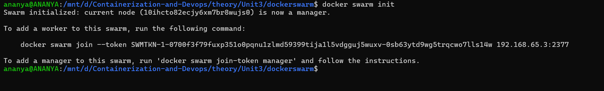
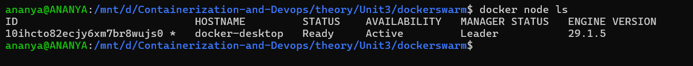
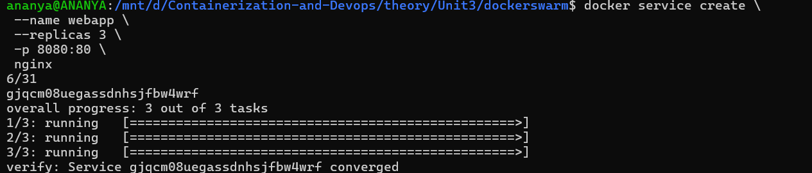
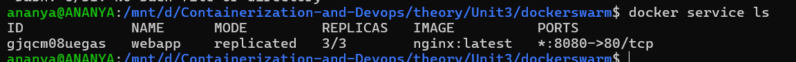
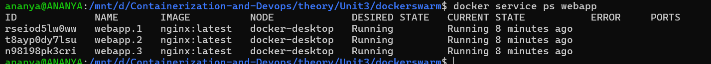
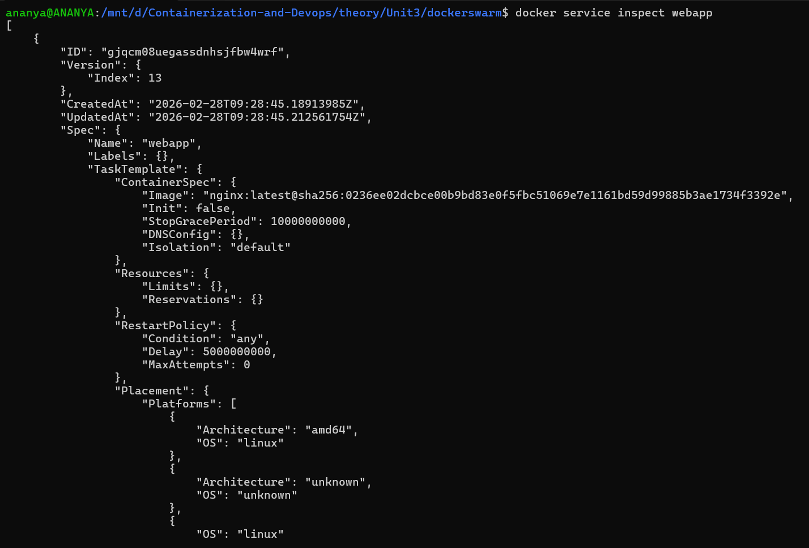
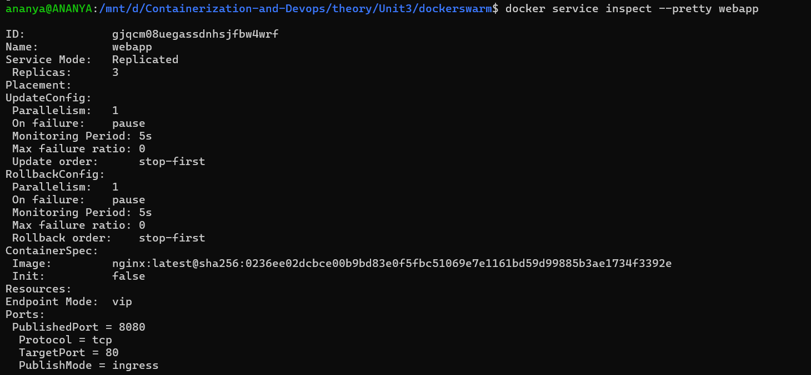
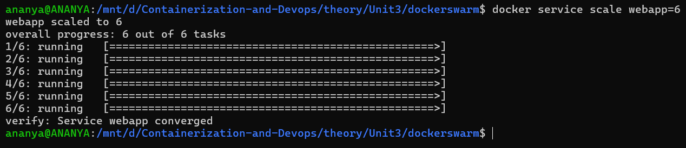

# Docker Swarm

## PART A — Create a Swarm

Step 1: Initialize Swarm
```bash
docker swarm init
```


Step 2: Verify Node
```bash
docker node ls
```


---
---
## PART B — Add Nodes to Swarm

---
---
## PART C — Deploy a Service
 Use Case : Deploy web server with 3 replicas.

Step 1: Create Service
```bash
docker service create \
 --name webapp \
 --replicas 3 \
 -p 8080:80 \
 nginx
```

Explanation :
- docker service : Manage swarm services
- create : Create new service
- --name webapp : Assign service name
- --replicas 3 : Run 3 container instances
- -p 8080:80 : Publish port
   - 8080 : Host port
   - 80 : Container port
- nginx : Image name

Step 2: Check Services
```bash
docker service ls
```
- ls : list all services



Step 3: Inspect Tasks
```bash
docker service ps webapp
```
- ps : Show tasks (containers) of service
- webapp : Service name


---
---
## PART D — Inspect the Service
- Use Case : Check configuration & runtime details.
```bash
docker service inspect webapp
```

- Explanation
  - inspect : Show detailed JSON configuration
  - Useful for debugging
- For formatted output:
```bash
docker service inspect --pretty webapp
```
 --pretty :  Human-readable format


---
---
## PART E — Scale the Service
- Use Case : Traffic increased during sale → need 6 replicas
```bash
docker service scale webapp=6
```

 Explanation
- scale : Change replica count
- webapp=6 : Desired replicas
Verify:
```bash
docker service ls
```
- Swarm automatically:
  - Creates new containers
  - Distributes them across nodes

